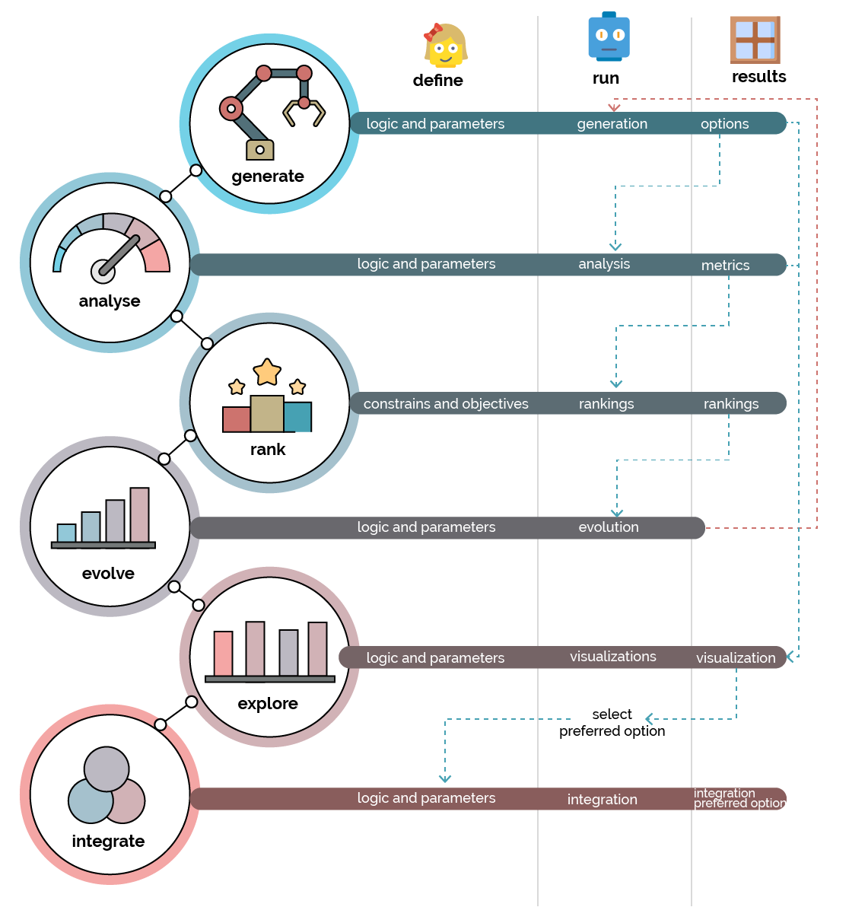

# Anatomy of Each Stage

Each of these stages can be further broken down into _`define`_, _`run`_ and _`results`_ steps. The _`define`_ step is the responsibility of the designer, while the _`run`_ and _`results`_ steps are performed by the computer.

Using this breakdown, let's look at what the_`generate`_ stage would entail.

### Define

For the _`define`_ step, the designer will need to do the following:

* Establish the generation algorithm - this is the logic that defines how designs are generated, which may include things like constraints and rules.
* Provide the generation parameters - these are the variables or inputs needed for the previously-defined algorithm.

This _`define`_ step is present and vital for all stages of the generative design process, as the validity of outputs relies on the quality of the designer’s contribution in this step. 

With clear and concise logic, the computer can provide suitable outputs.

### Run

Once everything is defined in the algorithm and its accompanying parameters, the computer begins to _`run`_, meaning it starts to generate different design options. This process might happen locally on the designer's computer or, for more intensive calculations, it may happen using cloud computing.

### Results

The things that are generated during the _`run`_ step are the final outputs from each stage. These are then used as inputs or parameters in subsequent phases. 

For example, the designs created in the _`generate`_ phase will be used as one of input parameters in the _`analysis`_ phase.

## Overall Process

We can map these stages and steps together in a single diagram, allowing us to visualize the order of each stage and their dependencies. 

The diagram shows us that:

* Each stage and step is dependent on the previous one.
* The entire study process is repeatable, as each iteration learns from the previous results.

