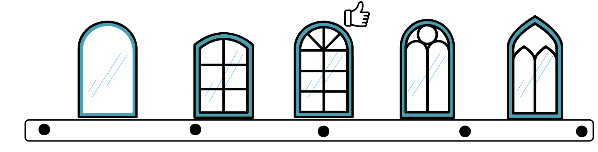

# What Goes Into a Generative Design Process?

## Stages

As previously discussed, generative design allows for a more integrated workflow between human and computer. This workflow involves the following stages: _`generative`_,_`analyze`_,_`rank`_,_`evolve`_,_`explore`_, and _`integrate`_.

### Generate

This is the stage when design options are created or generated by the system, using algorithms and parameters specified by the designer.

### Analyze

The designs generated in the previous step are now measured, or analyzed on how well they achieve goals defined by the designer.

### Rank

Based on the results of the analysis, design options are ordered or ranked.

### Evolve

The process ranks the design options to figure out which direction they should be further developed or evolved into.

### Explore

The designer compares and explores the generated designs, inspecting both the geometry and evaluation results.

### Integrate

After choosing a favorite design option, the designer uses or integrates this design into the wider project or design work.

