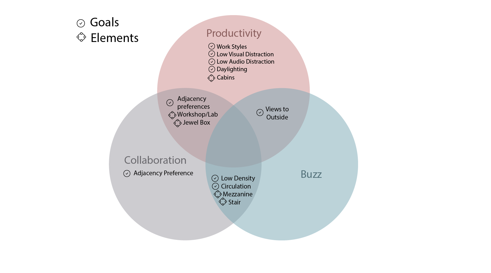

# MaRs Innovation District of Toronto

For the design of the new office and research space in the MaRs Innovation District of Toronto, Autodesk leveraged generative design processes. Starting with high-level goals and constraints, the design team used the power of computation to generate, evaluate, and evolve thousands of design alternatives. The result was a high-performing and novel work environment that would not have been possible to create without this approach.

### Generate

>Design goals - Mars Innovation District - The Living

The designers created a geometric system that allowed the exploration of multiple configurations of work neighborhoods, amenity spaces, and circulation zones. This work represents the _`define`_ step of the _`generate`_ phase.

The computer used this algorithm, varying its parameters to produce thousands of design options.

### Evaluate

> Design option evaluated and selected- Mars Innovation District - The Living

To begin with, information was collected from employees and managers about work styles and location preferences. Based on this data, six primary and measurable goals were defined:

* work style preference
* adjacency preference
* low distraction
* interconnectivity
* daylight
* views to the outside

The designers then created an algorithm to measure how any given floor plan can be measured against each of the stated goals above. Known as _`evaluators`_, these algorithms represents the _`analyse`_ & _`rank`_ stages of the generative process.

After the algorithms were formulated, the computer used them to evaluate each of the designs generated in the previous stage against the defined goals.

### Explore

> Design Options - Mars Innovation District - The Living

After the designs were evaluated, the designers explored the _`solution space`_ : (the generated designs together with their evaluation results). Taking into account each defined goal, they identified the design that best achieved the goals overall.
