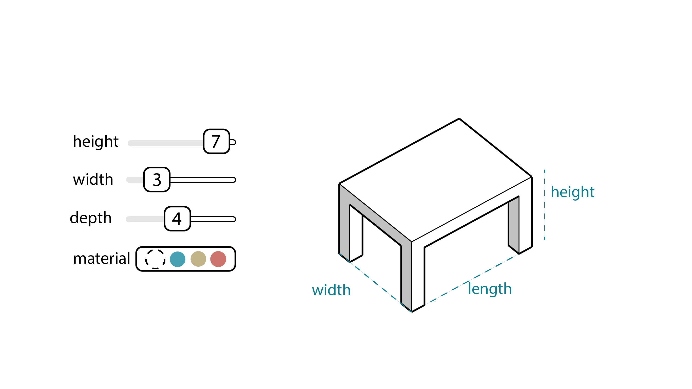
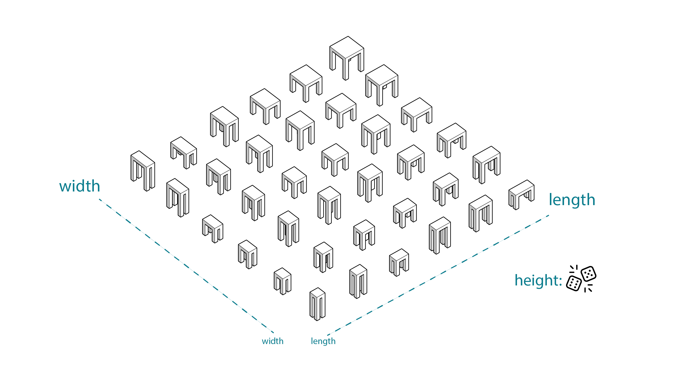

# Furniture Design

Looking at a simpler example, let's consider the process of designing a typical, four-legged table.

Using a standard approach, you as the designer would manually define the length, width, height and material of the table. The resulting output is a single, physical object with a fixed, immutable form. Here, you have the option to test several distinct sets of dimensions and material combinations to end up with three or four prototypes \(or however many iterations you wanted\).

In a generative design approach, you would instead create an algorithm that specifies:

* a range of permissible values for each dimension;
* a series of available materials and their properties \(such as cost/m²\); and
* a set of goals that measure how successful a table design is.

## Generate

Then, you would use a computer to run the algorithm and generate a series of designs that fall within the ranges you previously specified. 

Some designs will be short and wide, others will be tall and thin, but each will satisfy the user-defined constraints. This is key, as many designs can be generated very quickly, much more than any human could feasibly examine.

> Let's imagine the computer looked at 20 different values for each of: length, width, height, table/leg material combinations. The resulting solution space would be 20\*20\*20\*20 = 160,000 designs, which is way too many options for a person to reasonably evaluate.

_Above: Matrix showing 36 generated table designs, varying width, length, and height._

## Evaluate

The next step is to define how the generated designs are evaluated. This is your opportunity to clearly express your design goals.

_Above: A range of table designs \(sizes\), colour-coded based on evaluator function result \(cost\)._

Let's see how different design goals could be expressed in this _`evaluation`_ stage:

| Design goal | Analysis method | Ranking method |
| :--- | :--- | :--- |
| lowest cost per desk, with minimum 800mm x 600mm size | desk size: at least 800mm x 600mm in size = _`yes/no`_   and  desk cost: area \* material cost/m² = currency _`$`_ value\) | lowest cost first and only options that satisfy area requirements |
| most profitable  \(largest desk area with lowest material cost\) | desk area = outputs m²  and  unit cost \(area \* material cost/m²\) = currency _`$`_ value | largest area and lowest cost |

The matrix above exemplifies how you can use this stage in the generative design process to design for wildly different scenarios.

In the first scenario, lowest overall cost is the driving goal, so we can expect small desk sizes and cheap materials while still satisfying the size requirement. This scenario would be relatively simple for humans to replicate, so generative design would only come in handy when the variation or complexity of material costs is high.

For the second scenario, we're aiming to maximize return on investment \(ROI\) for each desk. This means that we can expect larger, more expensive desks than the first scenario, but that still have the best overall ROI. It wouldn't be unexpected for this process to identify a desk with cheap legs and more expensive tabletop materials as a viable option. 

This second scenario is a good illustration of using generative design to work towards multiple and competing goals, which is very hard for humans to replicate.

_Above: Visualizing evaluator function results as a color range._

As you can see, both of these examples follow the same fairly generic process, which is why there are so many possible applications of generative design in areas as diverse as aviation, automotive and building design, manufacturing, and product design.

