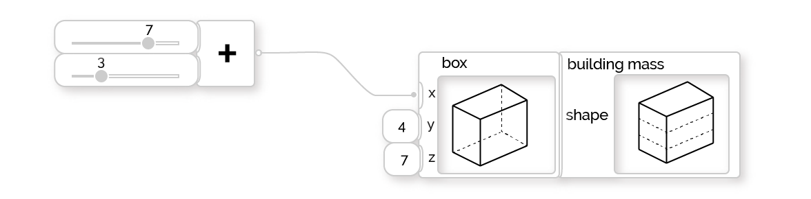

# Visual Programming

Visual programming is a form of coding that, unlike textual programming, does not require compiling code or familiarity with a textual programming language \(like C\# or Python\). Instead, it uses a visual interface where a user connects small nodes of pre-defined functionality. Together, these nodes form a larger network of functionality that can achieve complex goals. This approach is easier to learn than textual programming and makes tasks that were previously reserved for expert coders accessible to everyone.

Recently, there has been a significant shift in the AEC industry towards visual programming. This change is becoming commonplace for many teams as the industry begins to move away from traditional tools like CAD \(Computer Aided Design\). While there will always be a place for CAD tools, visual programming applications enable a new approach to design. Design no longer needs to be a series of static modelling operations, but rather a dynamic, customizable flow of tasks.

If you’d like to explore this in more detail, please refer to the sections on visual programming in the following primers \(these documents are separate from this one\):

* [Dynamo Primer](http://primer.dynamobim.org/01_Introduction/1-1_what_is_visual_programming.html)
* [Grasshopper Primer](http://grasshopperprimer.com/en/index.html?index.html)

