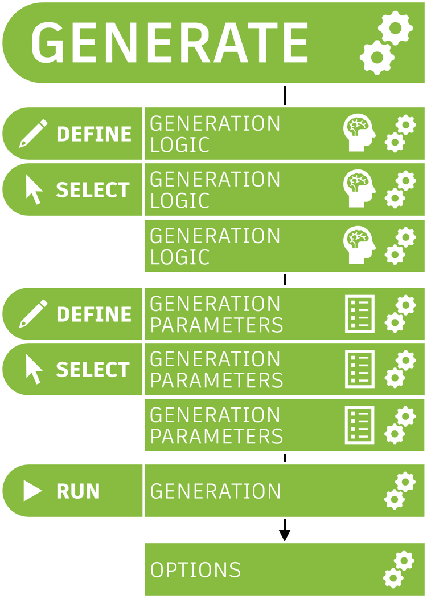
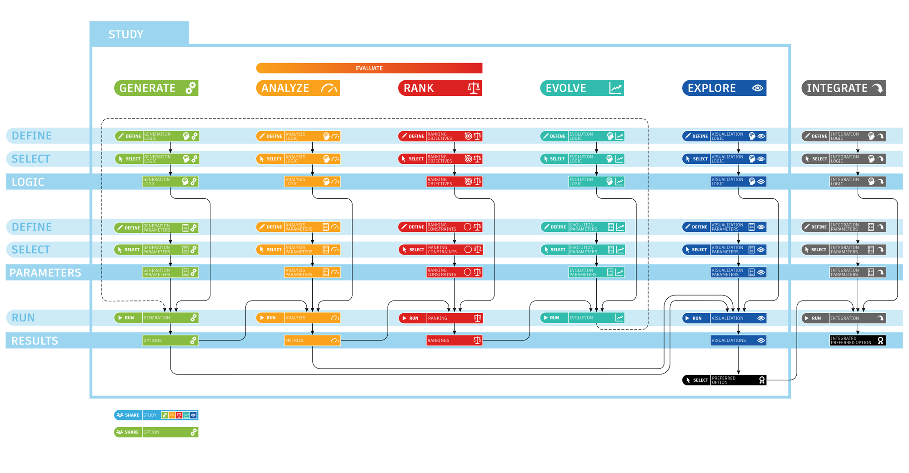

# What goes into a Generative Design Process?

As previously discussed, generative design allows for a more integrated workflow between human and computer, and as a result both are required to undertake a series of steps that allow the process to take place. These steps can be categorised into the following:

 

 

Each of these steps is broken down into *define*, *select*, and *run* with the first two steps the responsibility of the designer and the only the *run* step being performed by the machine. Bearing this in mind if we look in more detail at the generate stage as an example:

At the *define* stage, the expertise of the designer is needed to establish not only the logic for the generation of the design, but also the generation parameters, which may include a series of constraints and variables. The *define* stage at all steps of the generative design process is vital, and the validity of the outputs is reliant on the quality of input at this stage. Only with clear and concise logic, will the machine be able to articulate that information and provide suitable outputs.

The next stage within each of the steps, is the *select* process. Here once again, the designer is required to tell the machine which logic and parameters should be used as part of the generation. 

Finally, once all this is satisfied, the machine begins to *run* the algorithms and designs. This processing might be local or, for more intensive calculations, run using cloud computing. 

