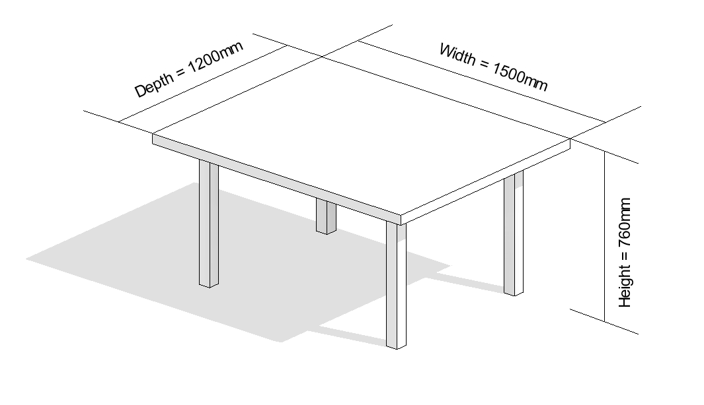
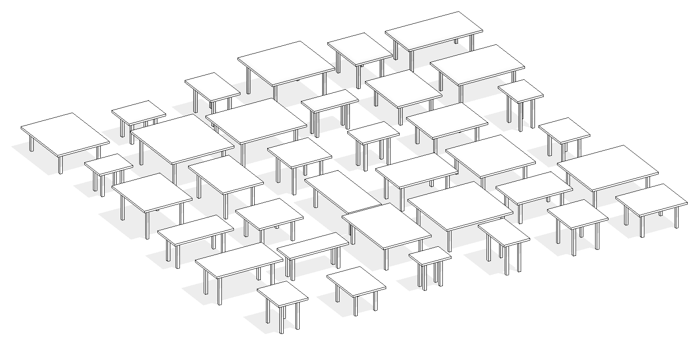

# An Example of Generative Design

Let’s look at several examples that illustrate how generative design can help you achieve your design challenges.

### Building Design

For the design of the new office and research space in the MaRs Innovation District of Toronto, Autodesk leveraged generative design for architecture. Starting with high-level goals & constraints and then used the power of computation to generate, evaluate, and evolve thousands of design options. The result is a high-performing and novel work environment for Autodesk that would not have been possible to create without this approach.

**Generate**

A geometric system was created by the designers that allowed the exploration of multiple configurations of work neighbourhoods, amenity spaces and circulation zones - this represents the `define` step of the `generate` phase as defined previously.

The computer used this algorithm, varying its parameters to produce thousands of design options. 

**Evaluate**
To begin with, information was collected from employees and managers about work styles and location preferences. Based on this data, six primary and measurable goals were defined:

*   work style preference
*   adjacency preference
*   low distraction
*   interconnectivity
*   daylight
*   views to the outside

The designers then created an algorithm to measure how any given floor plan can be measured against each of the stated goals above. Known as `evaluators`, these algorithms represents the `analyse` & `rank` stages of the generative process.

After they were formulated, the computer used these algorithms to evaluate each of the designs generated in the previous stage against the defined goals.

**Explore**
Once designs have been evaluated, the designers then explored what is often called the `solution space` : the generated designs together with their evaluation results. Taking into account each defined goal, they identified the design that best balanced their defined goals.

 

 

### Product Design

Looking at a simpler example, let's consider the process of designing a typical, four-legged table. Using a standard approach, a designer would manually define the height, width, depth & material of the table, and the resultant output would be a single, physical object with a fixed, immutable form. Perhaps the designer tests several distinct sets of dimensions & material combinations and ends up with three or four table prototypes.

In the generative approach, the designer would instead specify: 

* a range of permissible values for each dimension 
* a series of available materials and their properties (such as cost) 
* a set of goals that measure how successful a table design is 

The designer would then use the computer to help him/her generate a series of designs falling within the specified range. Some designs will be short and wide, others will be tall and thin, but each will be consistent with the user-defined parameters. This is key, dozens of designs can be generated in an instant, much more than any human could feasibily examine, so that the best ones can easily be identified.

As you can see, this describes a fairly generic process, which is why there are so many possible applications of generative design, in areas as diverse as aviation, automotive and building design, manufacturing, and product design. 
