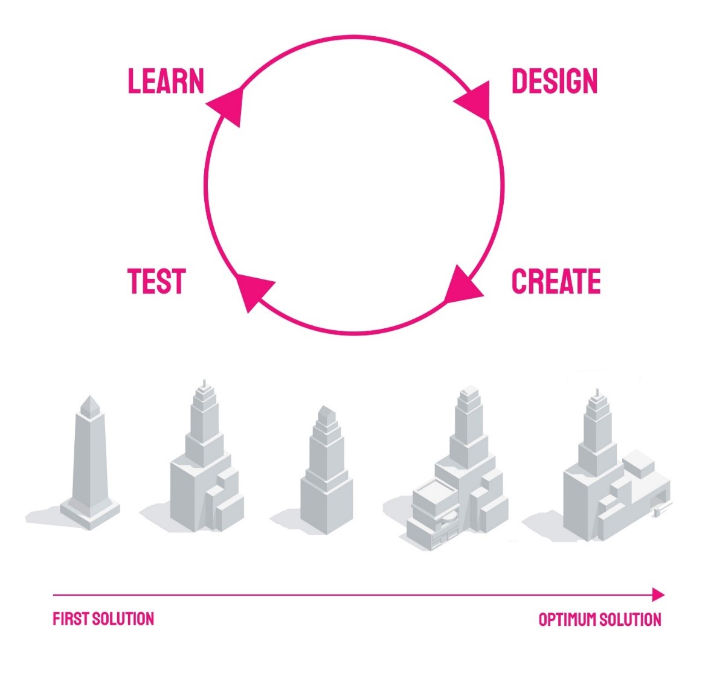

# What is Generative Design?

In the past, the term generative design may have been used in the context of generating permutations of designs, creating geometry from some simple inputs or even just building computational graphs using Dynamo or Grasshopper. 

 

We would argue that an accurate definition of generative design would be:

**/ gen·er·a·tive de·sign /**
noun 

>A system that produces design studies (alternatives), evaluates them against quantifiable goals, improves studies by using results from previous ones, and ranks results based on how well they achieve the set goals.

Generative design can then be described a specific application of the Computational Design approach, with a few distinctions that:

* the designer defines goals to achieve (rather than the exact steps to achieve a design) 

* the computer generates many designs (not just one) 

* it finds the optimal solution satisfying multiple competing goals, amongst all generated designs
