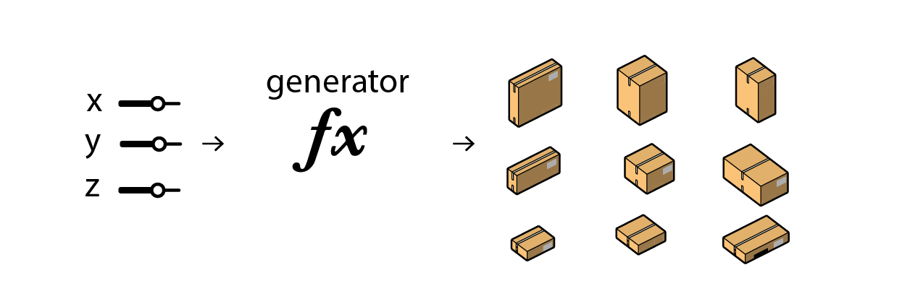
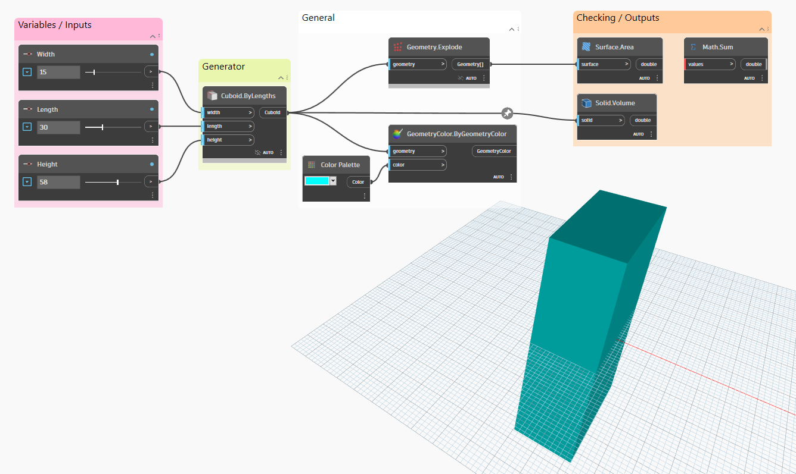

# Generators

Generators are the logic pathways that create new potential solutions in a generative design approach. In other words, they are the engine of the algorithm - they give the rest of the program something to evaluate.

Generators can be very simple, for example, a function that outputs totally random designs; or they can be highly sophisticated, for example, a network model that learns over time. Regardless of their complexity level, what they do overall is generate new data in whatever form the user desires.

In the table example we saw earlier, the generator was the block of code that created the different table designs. In another example, a generator could spit out a series of floorplans. 

In the simple Dynamo example below, the highlighted node acts as the generator and creates the cuboid in the image. It takes the input values and generates a design option using these variables. 

When the values change and the programme is re-run, the generator node is called into action again to create a new design option. In a generative design process, this generator could be a single function or a series of functions pieced together that produce hundreds - or even thousands - of different options.

