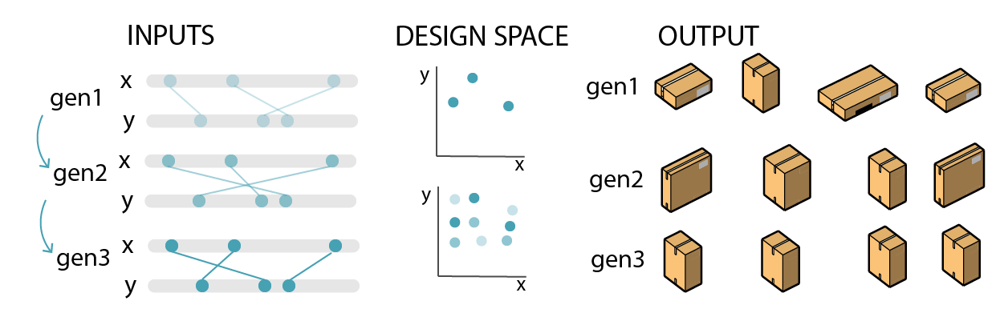
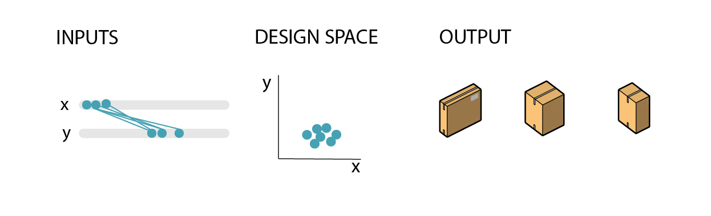

# Solvers

'Solvers' are a tools that can automatically run a script many times that contains both generators and evaluators.

Solvers typically require inputs to be very specific. Often, the greatest challenge is defining your problem in a way that a solver can understand. 

To take a simple example, your phone’s calculator is a solver for addition, subtraction, and division – but it only works if you punch things in correctly.

A solver can use different methods to process these scripts in different ways. The methods currently available in Generative Design are listed below.

## Randomize

'Randomize' generates a specified number of design options by randomly assigning a value to each of the input parameters. This process is used for optioneering processes in Generative Design.

## Optimize

'Optimize' is the method for doing an optimization run with Generative Design. During an optimization run, Generative Design will develop the design based on the evaluators outputs. 

The optimization process works by creating multiple generations of a design, where each iteration will use the input configuration from previous generation to optimize the new design options.

## Cross Product

'Cross Product' lets you explore the entire design space of your design by combining each step of every parameter with the remaining parameters.

## Like This

'Like This' will make Generative Design apply slight variations to your current input configuration. Using this method lets you explore different variations of a design that you already like.

