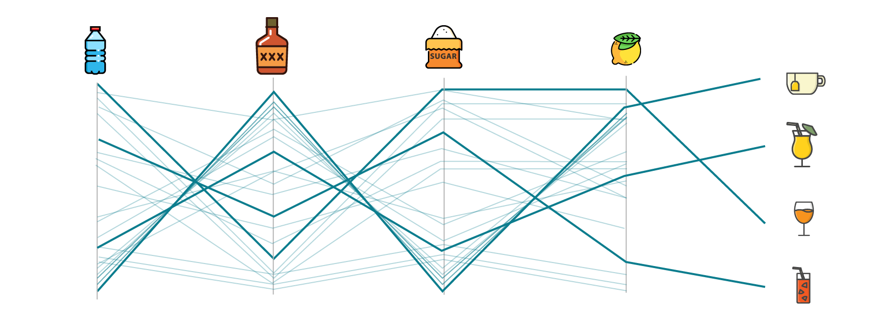
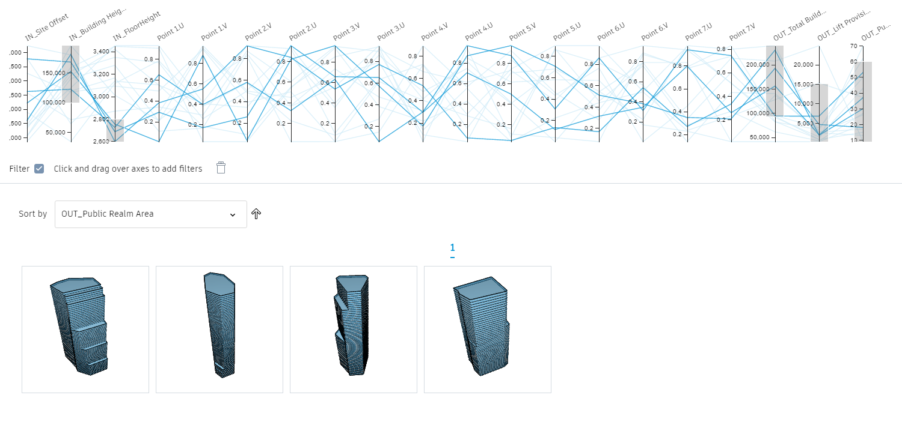

# Optioneering

#### What is Optioneering?

Optioneering involves creating design options that are not guided by outcomes while they are being created. Optioneering methods can be used to **explore a design space quickly when you might not know what metrics you want to optimize for yet**. After performing optioneering, the designer can sort and filter design variants to identify options that are particularly aligned with her design objectives.

The example above illustrates a possible simplified use of optioneering. Imagine you want to mix a cocktail drink. You can gather some possible ingredients and mix them in different measures. A visual way of representing and exploring alternatives is an optioneering graph. You can allign all ingredients \(variables\) and by varying their amount show possible outputs. 

#### Advantages

* Gives you a direct relation between **variables** \(input\) and **design results** \(output\)
* Easy to create constrains limiting the design span that you want to explore. 
* Enables changing variables manually. 

#### Going Back to Architecture

In the AEC industry instead of ingredients you have variables and instead of cocktail drinks you have design options but the concept remains the same. 

> Icons on Optioneering graph: Icons made by Smashicons from www.flaticon.com
