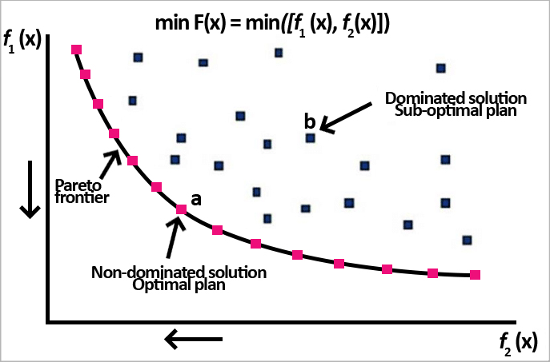

# Objective Function 
An objective function is the output that you want to maximize or minimize. It is what you will measure solutions against to decide which is best. The objective function can be thought of as the “goal” of your generative design process. In finance the objective function is to maximize portfolio value, in aerospace engineering the objective is often to minimize weight.

> The key is that the objective function must be quantifiable, you must be able to put a number to it. 

In generative design workflows, we are not limited to one objective (single objective optimization) we can also have multiple objectives or goals that we are trying to optimise our design against (multi-objective optimization).   

## Single Objective Optimization
When we have only one objective function, the system will return one optimal solution eg. return surface with largest area.

## Multi Objective Optimization

Usually, optimizing designs involves multiple competing objectives, therefore optimization becomes a matter of finding the best trade-off between these objectives rather than finding the one best solution. Whilst adding more objectives makes the optimization more complex, it also opens up for the possibility to get a set of optimal solutions that the decision maker can choose from, instead of just getting one single solution. 

Imagine having to optimize a structural design, we want the structure to be as light as possible, but at the same time we want it to be as rigid as possible. This example has two competing objectives; there will be one lightest solution and one solution stiffer than the rest, and in between those, a huge amount of designs that are compromises of weight and stiffness. The designs that cannot be improved more in one objective without hurting another objective is known as a pareto optimal solutions.

For a solution to be in the pareto optimal set it cannot be dominated by another solution. If a solution is worse than another solution on all objectives, then it is dominated and not in the pareto optimal set. 

 

