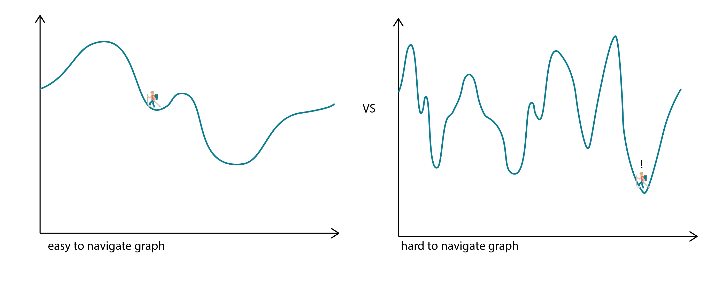

# Data

Data is the fundamental 'stuff' that you feed into your optimization model - the inputs and outputs that the objective function and constraints use to produce design solutions.

In design, data could be the density or price of construction materials, how many hours of sunlight a room can expect to receive in a day, or any goals that are important to your design exploration that you can define mathematically. In finance, data could be the assets you can buy or sell, and their prices; or, in the aerospace industry, data could be the unit weights and costs of carrying a certain kind of fuel. 

The optimization model in the generative design toolkit takes this data and uses it to maximize or minimize values as specified by the designer.

Real-world optimization problems are invariably solved algorithmically and there are often many algorithms that can solve the same problem. The most common algorithm used in Generative Design for architectural and engineering workflows is called the 'genetic algorithm'. We will cover this later on. 

