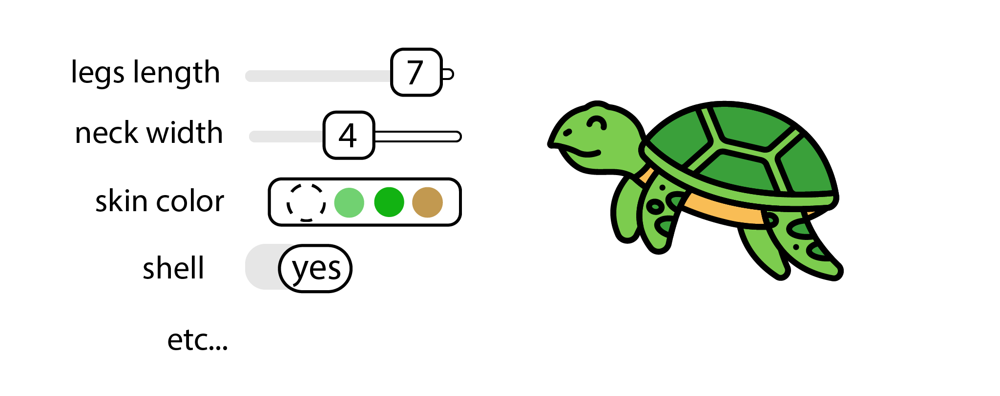
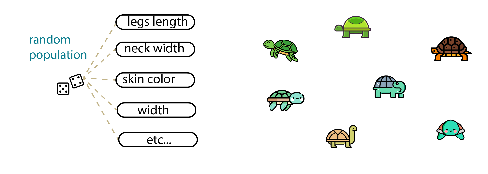

# Initialization Phase

The genetic algorithm begins with an initial population from which the selection process begins. 

Each 'individual' - or design option - in the population is a potential solution to the overall design problem. Each individual has a unique set of features - long legs, short legs, wide top, thin top, heaviness, lightness, etc. These features are the design options' genes and are what we use to evolve our design.

Some of these features are desirable, others are not. The algorithm leverages the differences between the design options to converge to the best possible solution.

Importantly, a genetic algorithm always begins with a set of potential solutions. When doing generative design with Generative Design for Revit and Dynamo, this initial population is created randomly, based on a 'seed' of fundamental input data. 

Often, a generative design algorithm is even used to create the initial population that can be fed into a genetic algorithm. In the initialization phase, it is important to consider how this initial population might vary. For example, if there is little or no variation in the population, then there is little chance that a good evolution will happen. 

To ensure there is good variation in your initial population, it is important to remember ****the following:

* At least some of the genes need to have a range so that their values can change between generations.
* The population size needs to be 'large enough'. The question of when a population is large enough is difficult to answer. Generally, it depends on the project, the number of genes, and the gene value range. A good rule of thumb is to set the population size to at least 3x the number of inputs. If the results don't start to converge to an answer, you may need to increase the population size.

