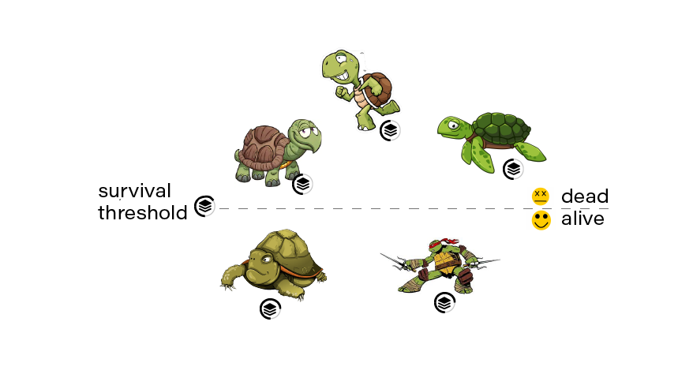

# Selection Phase

At each iteration, a certain proportion of the population (i.e., a subset of potential solutions) is selected to breed so that their features can be passed on to the next generation. This value is fixed in Project Refinery and is not currently available as a setting. Since the goal of a generative algorithm is optimization, we want to converge to some high-quality solution. It makes sense then to select only those solutions with the best possible features for breeding.

Selection is done on the basis of the fitness value created by the fitness function. Individuals with a higher fitness score have better genes. ([See previous section for a detailed discussion of fitness and fitness functions](/04-optimisation/04-08_the-evaluation-phase.md))

In the selection stage, individuals with a higher fitness score are more likely to be selected to breed. In this way, good features are preserved in the population and passed on to future generations.

As a final note, in certain circumstances it can be exceedingly difficult or even impossible to define a useful fitness function, or, if one can be defined, to be able to assign an accurate numerical fitness score to each potential solution. Randomized sampling and simulation are two useful workarounds when faced with these challenges.
