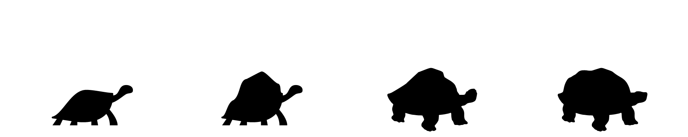

# Genetic Algorithms

In this section, we’ll look at the term _`Generative Algorithm`_

We will cover the following:

* [What Is a Genetic Algorithm?](02-04-01_what-is-a-genetic-algorithm.md)
* [Inizialization Phase](02-04-02_initialization-phase.md)
* [Evaluation Phase](02-04-03_evaluation-phase.md)
* [Selection Phase](02-04-04_selection-phase.md)
* [Crossover Phase](02-04-05_crossover-phase.md)
* [Mutation Phase](02-04-06_mutation-phase.md)

