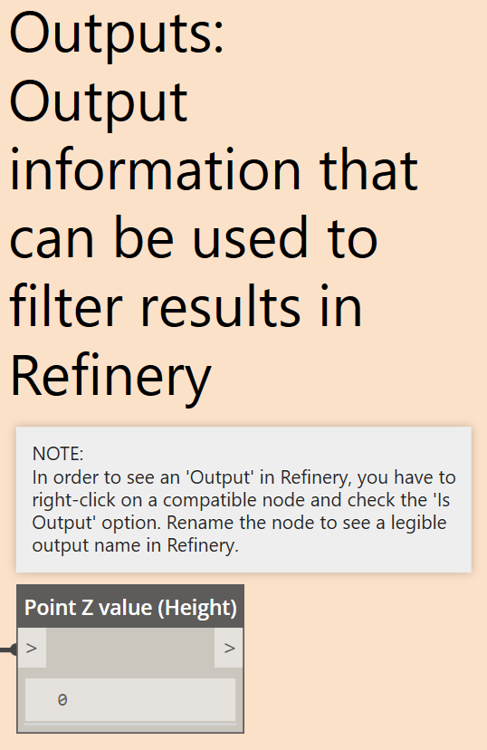

# Applying Generative Design to Practical Challenges

When you install the Refinery package for Dynamo, it ships with a few very useful practical examples.

### Example 1
The 08-EvaluateSurface.dyn graph in the Refinery examples, uses a single objective optimisation approach to find the highest Z point on a sinuous surface. The objective of the graph is to get the orange sphere to the highest peak of the surface.  

 

 

U and V values are used to move the sphere, these values are the driving inputs and need to be marked as *Is Input*. In order to know when the sphere is at the highest peak, a measure of the Z-value is made every time the sphere moves, this is the *fitness* value.

 

 

 

 

When running this graph in Refinery: 
* Use the Optimise Generation method 
* Under Inputs make sure that all inputs are checked 
* Under Outputs set the *Point Z value (Height)* to Maximize (if you want the lowest point, set it to Minimize).  
* Under settings set Population Size and number of Generations  
* Under Issues resolve any items 
* Click Generate to run the optimisation process.

 

 

As this is a Single Optimisation problem, Refinery returns only one result which is the global optimum or in this case the highest peak on the surface.

### Example 2
The 02-3BoxVolumeSurfaceArea.dyn graph in the Refinery examples, is a multi-objective optimisation problem with two competing objectives. The graph consists of three cuboids which have different variable parameters like height and location. The objectives of the graph are to find an option with minimal volume and maximum surface area.

 

 

The three cuboids, representing buildings, can vary in different ways. C1 can only change in height while C2 and C3 can vary in both height and location, make sure all these inputs are set as *Is Input*. Whenever an input parameter is changed the option's volume and total surface area will be calculated. These values are the *fitness* values, and need to be set as *Is Output*. 

 

 

 

When running this graph in Refinery: 
* Use the Optimise Generation method 
* Under Inputs make sure that all inputs are checked 
* Under Outputs set TotalSurfaceArea-MAX to Maximize and TotalVolume-MIN to Minimize 
* Under settings set Population Size and number of Generations  
* Under Issues resolve any items 
* Click Generate

 

 

A multi-objective optimisation run will not return one single result, but instead it will show all options which are non-dominated. A non-dominated option simply means that you can't make an option which is better in one of the objectives without it making the other objective worse. By arranging the scatterplot with the TotalSurfaceArea-MAX on the Y-Axis and the TotalVolume-MIN on the X-Axis it's easy to browse the options and find the best trade-off solution.

