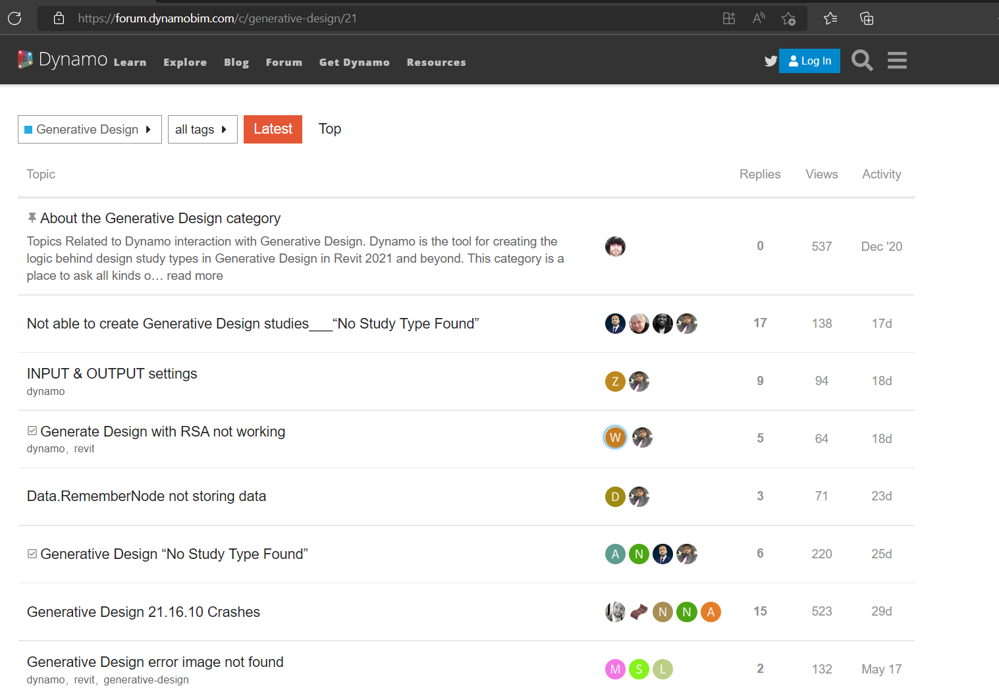

# Installing Generative Design

The generative design toolset is available to all AEC Collections subscribers starting with Revit 2021. 

[https://www.autodesk.com/solutions/generative-design/](https://www.autodesk.com/collections/architecture-engineering-construction/building-design?plc=AECCOL&term=1-YEAR&support=ADVANCED&quantity=1#internal-link-generative-design-in-revit)

## The Generative Design Community

The Generative Design Community is part of the Dynamo community. Visit, https://forum.dynamobim.com/c/generative-design/21 to setup your account with your Autodesk credentials to gain access to:

* Provide feedback and ask questions to the AEC Generative Design team.
* Discuss and collaborate with fellow Generative Design community members.

_Above: The Generative Design community homepage._

## Installing Generative Design for Revit and Dynamo

Starting with Revit 2021, Generative Design is available to all AEC Collection Subscribers and can be found in the Autodesk Desktop App or manage.autodesk.com.

After you have Generative Design for Revit installed, feel free to explore all of the learning resources on the [help guide](https://help.autodesk.com/view/RVT/2022/ENU/?guid=GUID-4E62D48A-783C-45F7-BD0D-F58E986E93F8).