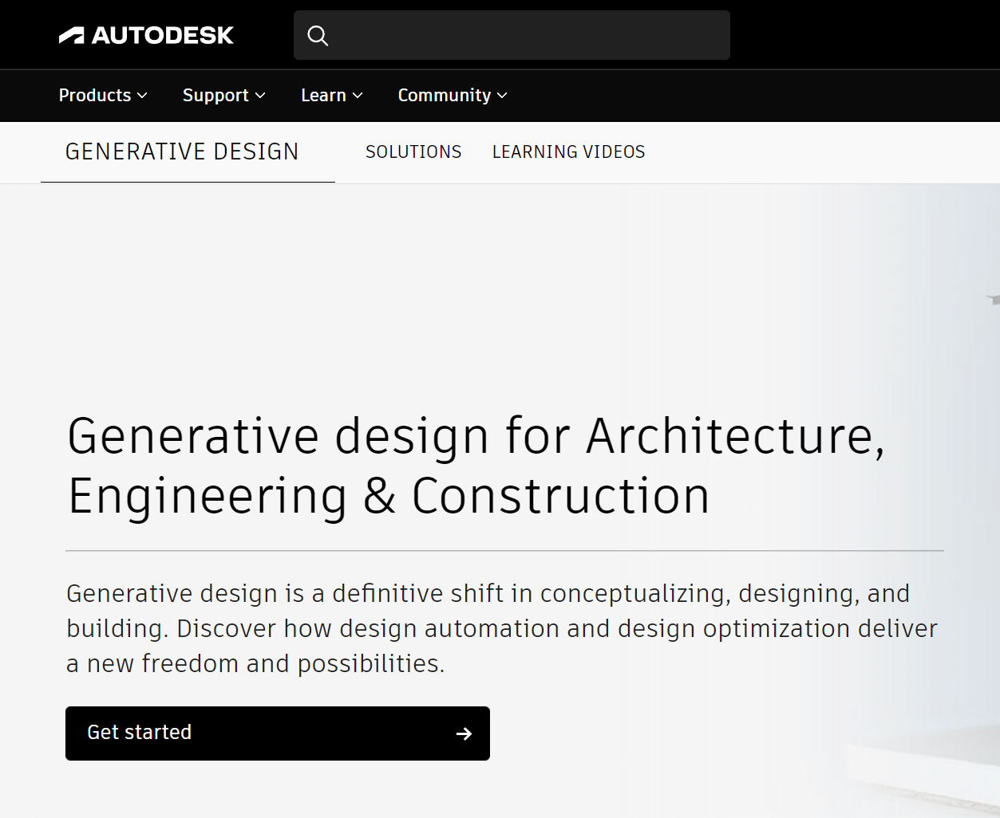

# Installing Generative Design

The generative design toolset for Revit 2021 is available to all AEC Collections subscribers. Generative design tools for Dynamo for Revit 2021 are available to all Revit 2021 users. If you want to experiment with generative design tools in Dynamo for Revit 2020 and below, you can join the Project Refinery beta and download an earlier version of the software. More....

[https://www.autodesk.com/solutions/refinery-beta](https://www.autodesk.com/solutions/refinery-beta)

## The Generative Design Community

After signing up for the beta version, you'll be presented with an overview of the Generative Design community. From there, you can do the following:

* Access detailed instructions on getting started and installation.
* Access demo/sample files.
* Access further learning resources.
* Provide feedback and ask questions to the AEC Generative Design team.
* Discuss and collaborate with fellow Generative Design community members.

Any new releases of Generative Design will be available to download and install from this location too.

_Above: The Generative Design community homepage._

## Installing Generative Design for Revit and Dynamo

To install the latest version of Generative Design, go to the 'Getting Started' section on Autodesk, where you'll see the latest pre-requisites for Generative Design.

After making sure you have all the initial requirements, please follow the step-by-step guide in the install section.

_Above: The Generative Design beta community Getting Started instructions page._

