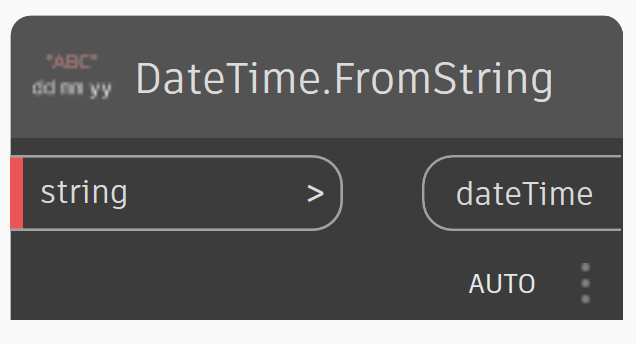

# Setting Up a Graph for Generative Design

## Inputs

To set up a Dynamo graph for use with generative design tools, right-click on each node used to drive the graph and ensure that the _`Is Input`_ option is checked. Renaming the node with a standard approach such as _`IN_description`_ will help to distinguish these inputs in the Create Study dialog.

1. Right-click on each node used to drive the graph and ensure that the 'Is Input' option is checked.
2. Rename the node as explained above. 
3. For slider nodes set values for Min, Max, and Step values. 

_Note: Current supported inputs include 'Number' or 'Integer' slider, 'Boolean', 'Number', 'string' or 'Revit Selection' nodes._

## Outputs

To define outputs for use with the generative design tools, right-click on the watch nodes and select the _`Is Output`_ option. Renaming the node with a standard approach such as _`OUT_description`_ will help to distinguish these outputs in Generative Design.

1. Right-click on the watch nodes and select the 'Is Output' option. 
2. Rename the node as explained above. 

_Note: Currently all outputs must be watch nodes with a 'Number' data type._

## Export to Generative Design

Once both inputs and outputs are set up correctly and your graph is saved,  it can be exported for use with the generative design toolset.  In Dynamo, navigate to the toolbar and select _`Generative Design> Export for Generative Design`_

Dynamo will then create a copy of your graph which will be available to launch in with Create Study. 

To create an export to use with Generative Design, please do the following:

1. In Dynamo, navigate to the toolbar and select Generative Design &gt; Export for Generative Design. Generative Design will then create a copy of your graph which will be available to launch.

_generative design will create a dependencies folder with relevant packages loaded_

## Launch Generative Design

To launch Generative Design, please do the following:

1. In Revit, navigate to Manage > Generative Design > Create Study.

Once the Create Study dialog has launched, you can map to your own folders where you saved your studies.

---

# Getting Creative with Inputs

## Creating an Interactive Date/Time Picker with Generative Design
Often times we are running analyses that depend on time of day. Within Revit we can use the time from the current model. But there are other ways.

In Dynamo core, we have the ability to define a `DateTime` object with the following node:

`DateTime.FromString`

Using this node, we can provide inputs that are usable in Generative Design by combining them into one string.

