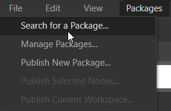
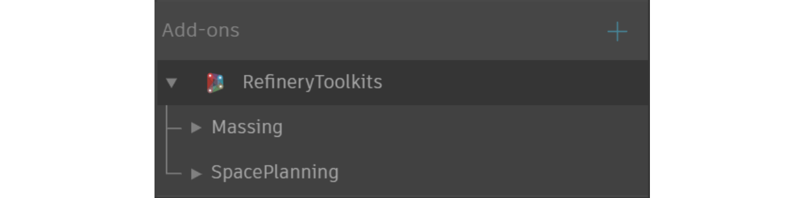

# Installing the Refinery Toolkit from the Dynamo Package Manager

The Refinery Toolkit is available in Dynamo's package manager and can be installed as you will do with any other package.

1. In Dynamo, navigate to the 'Packages' menu and click 'Search for a Package...'.

2. Search for the Refinery Toolkit \(it should be the first item in the list\). For more information on what each toolkit does, please refer to the [Github repository](https://github.com/DynamoDS/RefineryToolkits). 

3. Refinery Toolkits nodes will now be ready to use!

