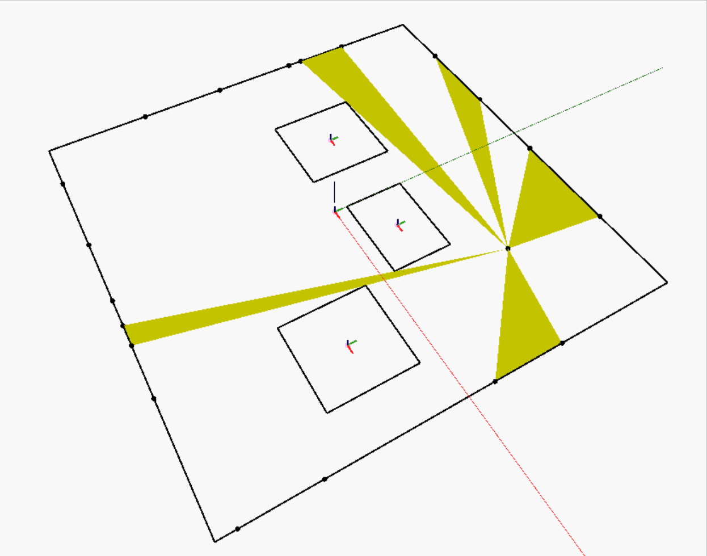
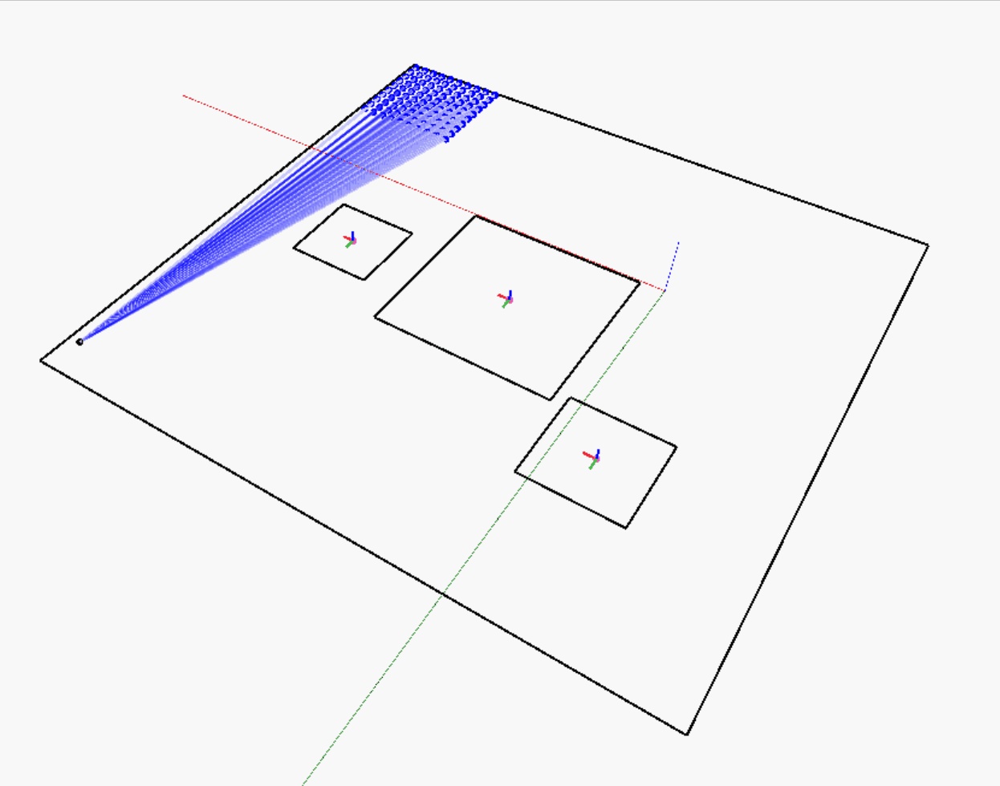
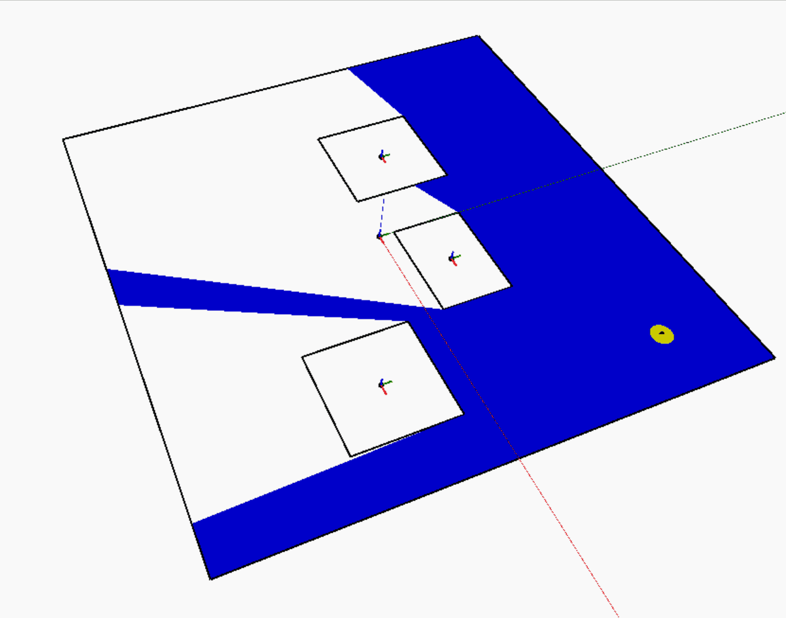

# Using the Refinery Toolkit
The package comes with a number of sample files provided to help you get started with each of the libraries.

It is highly recommended to start with the samples as they contain detailed notes and instructions on how to use each of the nodes. Feel free to open an issue or submit a PR on the [GitHub repo](https://github.com/DynamoDS/RefineryToolkits) if you’d like to see further documentation added. 

You can find the sample files in the package repository’s samples folder, as well as in the extra folder of the package when downloaded through the Dynamo Package Manager, typically found here: `%appdata%\Dynamo\Dynamo Revit\2\packages\Refinery Toolkit`

The samples show simple examples of how each node in the toolkit works. Some of the samples have a Revit version (marked with `(RVT)`) and some also have a version to be used directly with Generative Design in Revit (marked with `(RefineryVersion)`).

## Package Structure

The RefineryToolkit is organized into 4 categories, based on their use in a Generative Design process:

- **Generate** : In this category, you can find nodes to help generate design options.
- **Analyze** : The designs generated in the previous step can now be measured or analyzed on how - well they achieve goals defined by the designer. This category contains nodes to help with that.
- **Rank** : Based on the results of the analysis, design options can be ordered or ranked using the nodes in this category.
- **Explore** : The explore section contains nodes that help visualize where results are placed.

# The SpacePlanning Toolkit
The SpacePlanning Toolkit contains a collection of nodes to help you create and analyze generative space planning workflows. The toolkit will run in all versions of Dynamo.

The package currently contains 18 nodes including packing nodes for rectangles and cuboids, visibility analysis nodes, and many more that will help to create exciting generative space planning workflows, see below a few examples of what you can do with the toolkit.

## Packing
Packing algorithms are all about fitting items into a larger container; these algorithms are used across multiple industries to help solve and optimize packing problems.

There are two different packing methods in SpacePlanning toolkit, a Rectangular packer, and a Cuboid packer.
These can be used for things like exploring floor plan layouts or optimizing modular residential layouts as [Team Binception](https://twitter.com/KCMarchitect/status/1155527009826738177) did at the Toronto Dynamo + Generative Design Hackathon.

The Rectangular packer comes with 3 different packing strategies that determine how your rectangles are packed. These 3 strategies simply determine which free area the next rectangle gets packed into, meaning that each of these strategies will give you a different layout. Besides the 3 different packing strategies you can vary the layout by sorting the items, you need to pack differently. For example, you can sort them in ascending or descending order based on their area or sort using other methods. This provides countless possibilities when exploring different layouts.

---

## Visibility analysis

Designers use lots of different tools and software to understand and assess the designs they create, whether that be the layout of an office or the design of a mechanical system. Analyzing how suitable a design is and whether it will function as needed can be tricky. Using visibility analysis graphs, designers can understand more about the space and make informed design decisions.

With this in mind, the toolkit aims to provide a selection of nodes to help in analyzing visibility. Using these nodes, there are 3 types of studies that can be performed currently. `Visibility.OfLinesFromOrigin` lets you calculate the percentage of a line segment that is visible from a given point. This can be used to measure views to the outside, where the windows are represented by line segments as shown in the left-most gif below. `Visibility.OfPointsFromOrigin` is similar to `Visibility.OfLinesFromOrigin` but instead of using line segments, it lets you analyze how many points are visible in a collection from a given point. This can help when placing objects that need visibility to certain interest areas. The final visibility node in the toolkit is `Visibility.IsovistFromPoint` that creates an isovist from the given point. Isovists can be used to calculate the visible area of a space from a given point.

### More samples
Have a peek at all the different sample files included in the SpacePlanning Toolkit [here](https://github.com/DynamoDS/RefineryToolkits/tree/master/src/SpacePlanning).

## More information
The Refinery Toolkit is open source and is available on [GitHub](https://github.com/DynamoDS/RefineryToolkits), if you experience any issues with the nodes or have ideas for new nodes or library’s that should be added to the toolkit, please add them to the issues section.

---
_This article was originally posted on the Dynamo blog [here](https://dynamobim.org/refinery-toolkit/)._