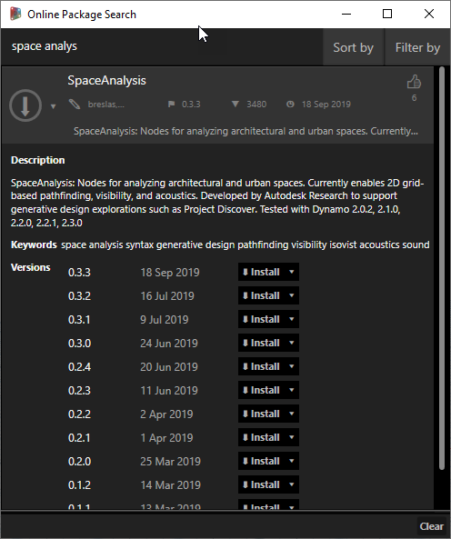
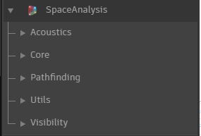

# Installing Space Analysis from the Dynamo Package Manager

Space Analysis is available in Dynamo's package manager and can be installed as you will do with any other package.

1. In Dynamo, navigate to the 'Packages' menu and click 'Search for a Package...'.

2.  Search for the Space Analysis package \(it should be the first item in the list\). For more information on what the Space Analysis package can do, please refer to this [Autodesk University Class from Kean Walmsley](https://www.autodesk.com/autodesk-university/class/Hands-Project-Rediscover-generatively-designing-Autodesk-Torontos-office-2019).

3. Space Analysis nodes will now be ready to use!

