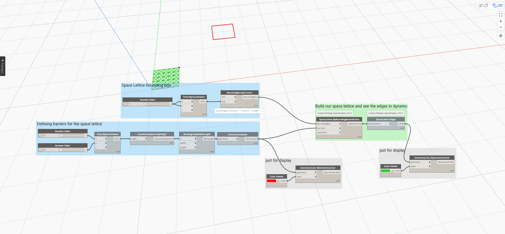

# Using the Space Analysis Package
The package comes with a number of sample files provided to help you get started with each of the supported workflows.

It is highly recommended to start with the samples as they contain detailed notes and instructions on how to use each of the nodes.

## Package Structure
The space analysis package is organizes into 5 main categories in the Dynamo library.

- **Core** : Core provides the framework for all space analysis workflows. This category contains the common [**SpaceLattice**](#Defining-a-Space-Lattice-with-Core-Nodes) object that is utilized in all space analysis workflows.

- **Acoustics** : This category contains nodes that support approximate acoustic analysis workflows.

- **Pathfinding** : Support for path finding workflows. This utilizes [Djikstra’s shortest path algorithm](https://en.wikipedia.org/wiki/Dijkstra%27s_algorithm). The pathfinding algorithms in this toolkit work on a grid (space lattice), with the size and resolution defined by the graph creator.

- **Visibility** : Support for visibility analysis using a [view cone](), or a [view point]().

- **Utils** : Miscellaneous utilities for use within the package.

---

## Defining a Space Lattice with Core Nodes

The Space lattice object is the base object for space analysis workflows. It is essentially a 2d grid with diagonal connections.

### Inputs:
- **boundingBox** - The Dynamo bounding box to generate a space lattice object for.
- **barriers** - A list of lines that represent areas where there would be no lattice present
- **resolution** - Space between two adjacent points of the lattice. _**(This uses your project units, so be sure to verify what those are prior to running)**_ default value = 0.2

#### Simple Space Lattice with Barriers

Sample File: [spaceAnalysis-CreateSimpleSpaceLattice.dyn](../../assets\hello\spaceAnalysis-CreateSimpleSpaceLattice.dyn)

Be sure to peek at the sample files in the extra folder for use-cases of the space lattice object.

---

## Acoustics
Space analysis supports general acoustic analysis which are very useful for Generative Design applications. While these analyses are not _necessarily_ validated. They can be very useful to use for constraints. _(These nodes can be used towards a design goal of "buzz factor")_.

### Additional Resources for Acoustics:
- [Introducing Acoustics in Space Analysis](https://www.keanw.com/2019/06/say-what-acoustics-in-space-analysis.html)
- [Multiple Source Acoustics](https://www.keanw.com/2019/09/build-your-own-soundsystem-space-analysis-now-supports-multi-source-acoustics.html)

---

## Path Finding
2D Path finding algorithms are included in space analysis. These are achieved using and implementation of [Djikstra’s shortest path algorithm](https://en.wikipedia.org/wiki/Dijkstra%27s_algorithm). 

A difference between space analysis path finding and the Path Finding in Autodesk Revit is, Space Analysis has no dependency on the Revit API - making it a perfect companion to Dynamo sandbox.

### Simple Two Point Path Finding

Probably the simplest example of this would be to use a start point and end point with a barrier in-between.

In the space analysis samples, this is demonstrated in: `spaceanalysis-pathfinding-01-one-path.dyn`

### Additional Resources for Pathfinding:
- [Using Space Analysis for Pathfinding](
https://www.keanw.com/2019/04/using-the-space-analysis-package-for-pathfinding-and-visibility-in-dynamo.html)

- [A Nice Introduction to Dynamaps and Space Analysis by ThatBIMGirl](https://www.keanw.com/2019/06/a-nice-introduction-to-dynamaps-and-space-analysis-by-that-bim-girl.html)

- [Comparing Space Analysis Path of Travel to Revit 2020's Version](https://www.keanw.com/2019/04/dynamo-space-analysis-and-revit-2020s-path-of-travel.html)