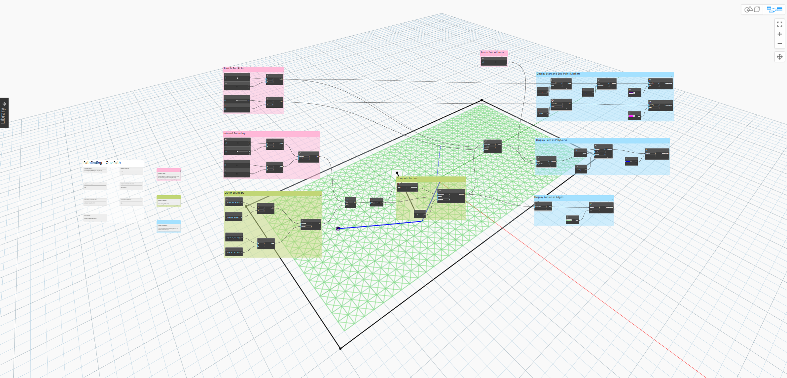
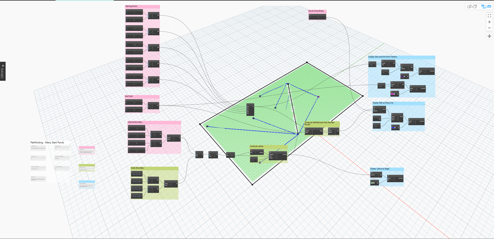

# Space Analysis for Dynamo

The Space Analysis package is a collection of nodes for analyzing architectural and urban spaces.

## Supported Workflows

There are currently a few node categories to work with inside of the Space Analysis package. The included nodes support the following workflows.

* Acoustics
* Path Finding
* Visibility

### Acoustics

Acoustic simulation.

### Path Finding

Path finding - with support for single or multiple start and endpoints / paths.

## Visibility

Visibility Analysis.

_image courtesy of [keanw.com](https://www.keanw.com/2019/03/the-space-analysis-package-for-dynamo-and-refinery-is-now-available.html)_
