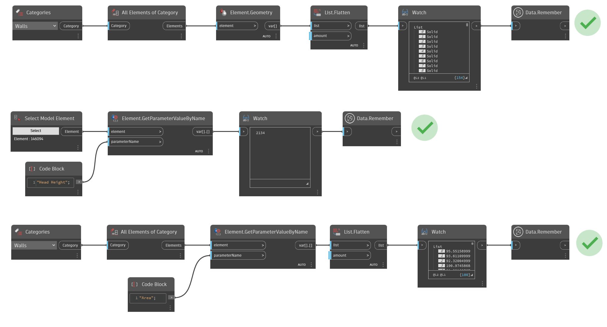
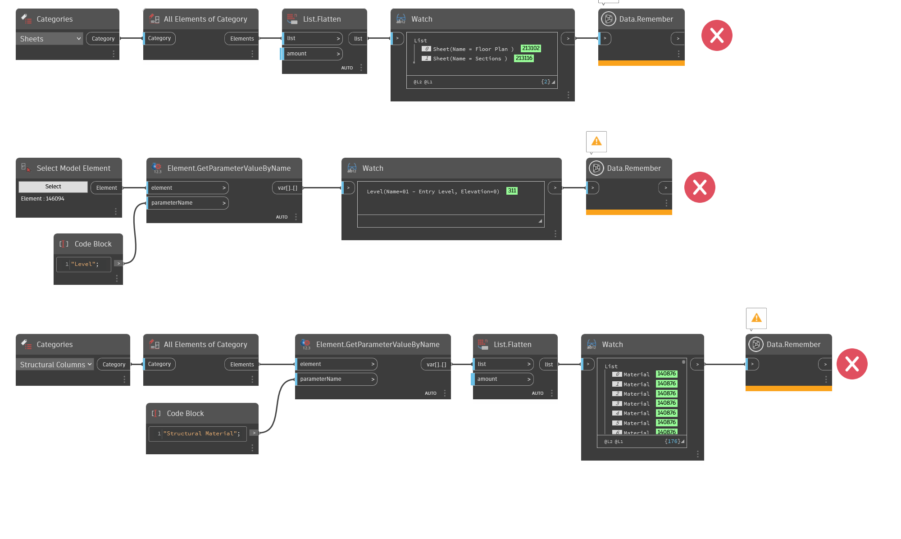

# Data.Remember Node Inputs

This node is designed to capture the output of any node and cache the results in the .dyn file when the graph is saved. 

It can hold both non-geometric data \(such as strings and numbers\) and geometric data \(such as solids, points and surfaces\) in a serialized format. This means that if, for example, you want to retain values in certain parameters or the underlying geometry of a wall or door, this node can handle both. 

Currently, the node is limited to these data types. Attempting to pass through other data, such as a collection of Revit Elements, Generative Design will return an error saying 'cannot store data of type'.

So, when you run the node inside Dynamo for Revit, the values will be stored. This means that, when you re-open your graph, this 'temporary data' will still be available to you - it will flow downstream from the Data.Remember node as if it had come directly from the execution of the nodes that were upstream.

