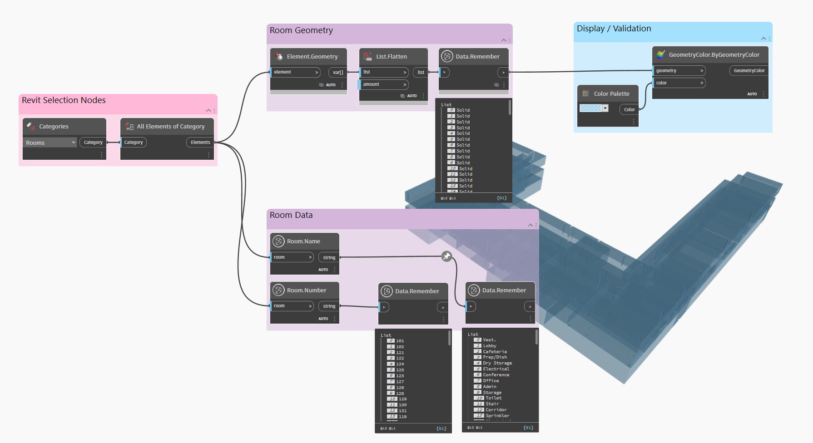
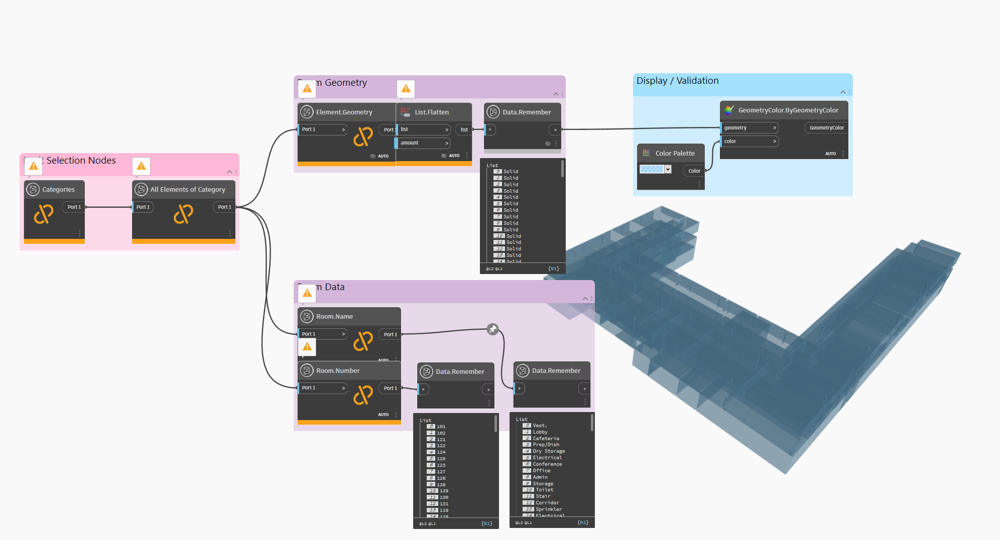

# How to Test Revit Data Capture

To begin a workflow that uses Revit data, please do the following: 

1. Create a graph in Dynamo for Revit \(aka 'D4R'\).
2. Use the common Revit nodes \('Categories', 'Select model element', etc.\) to pull information from Revit into Dynamo.
3. Add as many _`Data.Remember`_nodes to the canvas as you need. These nodes should be placed in between the Revit nodes and the rest of the graph. Make sure the information being passed through is the correct data type \(as mentioned in the previous section\). 
4. Run the graph so all Revit execute and all the _`Data.Remember`_ nodes have data passing through them.

You can now Create Study directly from Dynamo for Revit, or run it in Dynamo Sandbox to make sure you have captured all of the data that Generative Design will need to run independently of the Revit process.  To do this, follow the next steps: 

To do this, follow the next steps: 

1. Save the graph and close Dynamo/Revit.

2. Open DynamoSandbox and the graph you just created.  
3. Re-run the graph. Everything upstream will become an unresolved node - bear in mind that the _`Data.Remember`_ node will retain the cached information.

Now, Generative Design can use the data and geometry from Revit without needing to start Revit in the background each time.

