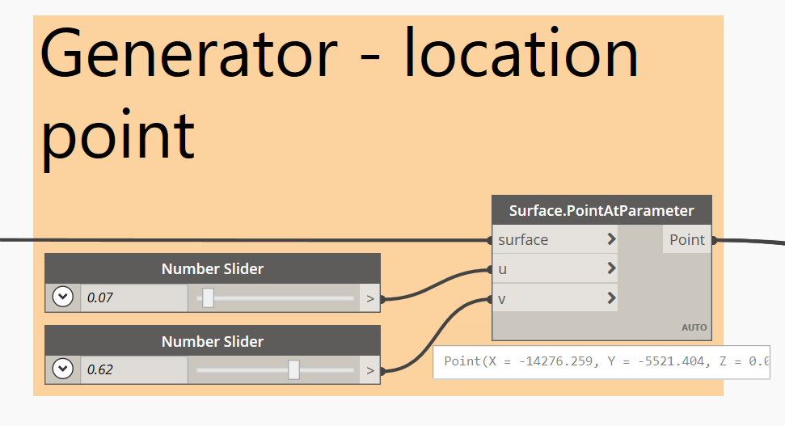

# Detailed Example Workflow

In the following example, we will use the steps from the previous section to cache data from Revit and perform an optimization process to find the best solution. Then, we'll push the result back to Revit.

_Note: All sample files for this example can be found in the_ [_`04_sample_files`_](https://github.com/DynamoDS/RefineryPrimer/releases) _folder in the Github repository._

## About This Example

The intention of this workflow is to find the best location for a desk in the office floor plate, where it maximizes the number of views to the outside. 

To do this, the information we need to cache in the _`Data.Remember`_ node includes all the geometry relating to the bounding elements of the room \(walls, doors, windows and internal obstructions\).

With this data, we will perform an optimization process to determine the best location for the desk from the thousands of permutations, before using the result and pushing the value back into Revit.

## Script Creation

The first step is to create our script. Remember, our script needs to contain both the generator \(to create the different options\) and the evaluators \(to assess the performance of each option against our criteria\).

## Data.Remember Node

In this example, there is a little work required to extract the correct geometry from each of the Revit elements. 

For this workflow, we need a set of polygons across a common plane. To get this information, we use a combinations of nodes in Dynamo to extract it from the walls, windows and internal columns. Once we have this geometry, we can use the _`Data.Remember`_ node to cache the values in the script.

## Generator

The generator of the script determines how Generative Design will move the point around the available space to find the best location.

## Evaluators

The evaluator of the script determines how each design option scores in relation to our overall goal. Remember the goal of this workflow was to maximize the number of views to outside. 

To enable this, we have a custom node that takes in the following inputs:

* view segments \(windows\)
* origin \(point location\)
* boundary \(overall floor plate\)
* internals \(any internal obstructions\)

The output of the node returns both a visual and non-visual output:

* visible segments \(sections of windows that can be seen from the point\)
* score \(a number between 0-1 that denotes a percentage amount of the total 360° view from the point\)

## Dynamo Sandbox

With the graph correctly set up and run once in D4R to cache the data, we can close Dynamo and Revit and open Dynamo Sandbox. 

As we know from the previous example, the Revit nodes upstream of the _`Data.Remember`_ node are marked as unresolved, but on running the graph the values are still cached in the _`Data.Remember`_ nodes.

## Generative Design

Now we are ready to automate our search. In the Create Study dialog, select _`Optimize`_ \(for more details on how to run an optimization process, please refer to the '[Optimization](../../02-deeper-dive/02-03_optimization/)' section\). 

For this study, we want to _`Maximize`_ the result. The automation  works to solve the design problem, taking into account the pre-defined population size and amount of generations .

In Generative Design, select 'Optimize' \(for more details on how to run an optimization process, please refer to the '[Optimization](../../02-deeper-dive/02-03_optimization/)' section\). We also want to maximize the result, so select 'Maximize'. 

Generative Design then works to solve the design problem, taking into account the pre-defined population size and amount of generations .

## Revit

To use a design option from Explore Outcomes, we simply click through either the charts or tables to select our design option. More detail on this is found in the '[Optimization](../../02-deeper-dive/02-03_optimization/)' section. 

When you choose your option in Explore Outcomes, the input values used by the generator in Dynamo will be set to the same nodes. Saving the graph saves these values back to the Dynamo file. If we close Dynamo Sandbox at this point and reopen Revit, we can also add additional Revit nodes to the end of the graph. This will take the point generated by the best option in Generative Design and place our desk \(family instance\).

Saving the graph saves these values back to the Dynamo file. If we close Dynamo Sandbox at this point and reopen Revit, we can also add additional Revit nodes to the end of the graph. 

This will take the point generated by the best option in Generative Design and place our desk \(or family instance\).

