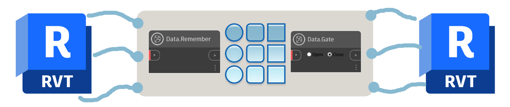
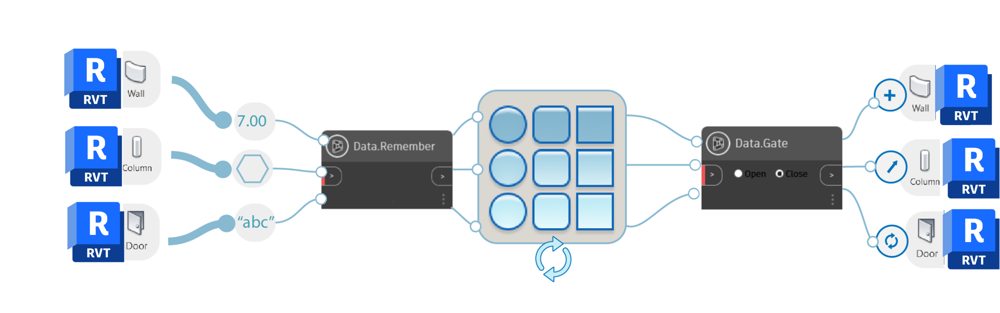

# Using Data from Revit

Using Generative Design in Revit can be a very powerful approach to quickly explore multiple design options. To ensure your studies are being executed efficiently make sure to use the Data.Remember and Data.Gate nodes appropriately. This will enable to control data that is imported from Revit and data that is used by the generative design workflow. It is important to place these nodes because generative design requires multiple iterations and making each iteration dependant on Revit may require heavy computation time. 

As seen below the Data.Remember nodes and the Data.Gate nodes will limit performing heavy computation tasks by only taking simple data inputs, as described in the [Data.Remember Node Inputs section](03-07-02_data-remember-node-inputs.md), to perform generative design studies. 

## Data.Remember Node

The Data.Remember node is used to store information from Revit, allowing you to use certain parameters from Revit elements in a generative design workflow.

## Data.Gate Node

The Data.Gate node controls the flow from the generative design workflow to Revit, allowing you to create or modify Revit Elements once, when you select the ‘Create Revit Elements’ inside generative design. 

