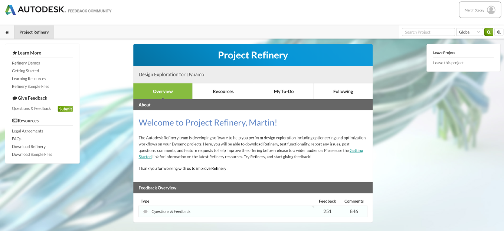

# Installing Generative Design

Generative Design is currently available as a Beta release, as of March 2019. In order to use Generative Design, you need to sign up to the Generative Design community, using your Autodesk credentials at the following website:

[https://www.autodesk.com/solutions/refinery-beta](https://www.autodesk.com/solutions/refinery-beta)

## The Generative Design Community

After signing up for the Beta you will be presented with an overview of the Generative Design community. From here you can do the following:

* Access detailed instructions on getting started and installation.
* Access demo/sample files.
* Access further learning resources.
* Provide feedback and ask questions to the AEC Generative Design team.
* Discuss and collaborate with fellow Generative Design community members.

Any new releases of Generative Design will be available to download and install from this location too.

_Above: the Generative Design community home page_

## Installing Generative Design for Revit and Dynamo

To install the latest version of Generative Design, go to the Getting Started section, where you can see the latest Pre-Requisites needed to use Generative Design. After making sure you satisfy these initial requirements, please follow the step-by-step guide in the install section.

_Above: the Generative Design beta community Getting Started instructions page_

