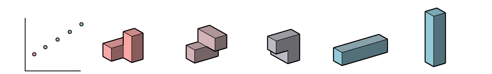

# Hello Generative Design for Revit and Dynamo!

Now that we're familiar with what generative design is and the basic concepts behind it, and also now that we've seen some example use-cases, the next question becomes:

> How can we leverage software tools to apply generative design principles to real-world design problems?

This chapter demonstrates the answer to this question through a series of common design challenges.

It's important to note that, although it sounds complex, a generative design approach is not limited to only solving complex design problems. In fact, once a designer has a computational design process set up, generative design can help solve design questions easily and eliminate huge amounts of manual work for easy and complex design problems alike.

