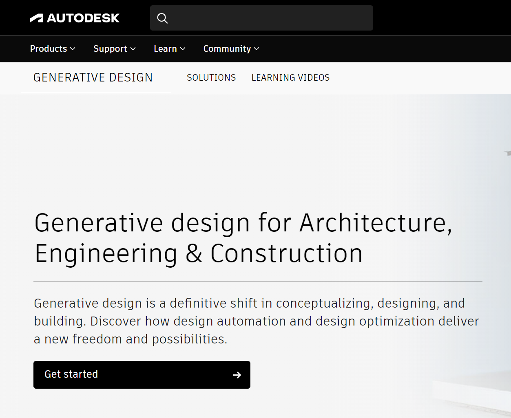
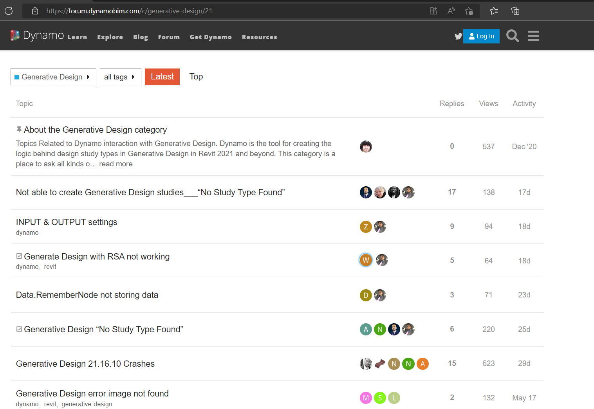

# Getting Started With Project Refinery

Project Refinery is currently available as a Beta release, as of March 2019. In order to use Refinery, you need to sign up to the Refinery community, using your Autodesk credentials at the following website:

[https://www.autodesk.com/solutions/refinery-beta](https://www.autodesk.com/solutions/refinery-beta)

## The Refinery Community

After signing up for the Beta you will be presented with an overview of the Refinery community. From here you can do the following:

* Access detailed instructions on getting started and installation.
* Access demo/sample files.
* Access further learning resources.
* Provide feedback and ask questions to the Refinery development team.
* Discuss and collaborate with fellow Refinery community members.

Any new releases of Refinery will be available to download and install from this location too.

 

_Above: the Refinery community home page_

 

## Installing Refinery

To install the latest version of Refinery, go to the Getting Started section, where you can see the latest Pre-Requisites needed to use Refinery. After making sure you satisfy these initial requirements, please follow the step-by-step guide in the install section.

 

_Above: the Refinery beta community Getting Started instructions page_

