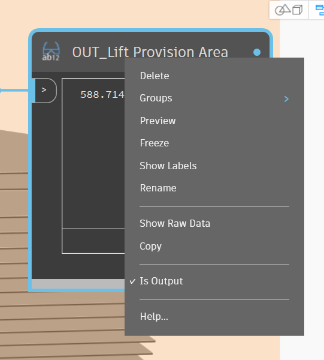
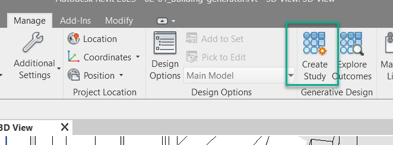
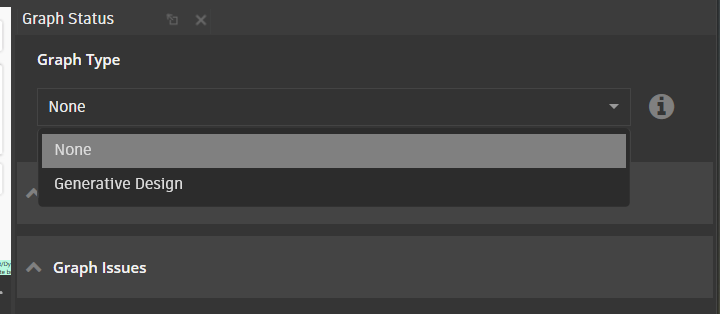

# Setting Up a Graph for Revit Generative Design

## Inputs

To set up a Dynamo graph for Generative Design right-click on each node used to drive the graph and ensure that the *`Is Input`* option is ticked. Renaming the node with a standard approach such as *`IN_description`* will help to distinguish these inputs in Generative Design.

\(Note: currently all inputs must be number slider nodes\)

 

## Outputs

To define outputs in Generative Design, right-click on the watch nodes and select the *`Is Output`* option. Renaming the node with a standard approach such as *`OUT_description`* will help to distinguish these outputs in Revit Generative Design.

\(Note: currently all outputs must be watch nodes with a data type of Number\).

 

 

## Export to Generative Design

Once both inputs and outputs are correctly set up and your graph is saved, Generative Design can be exported. In Dynamo navigate to the toolbar and select _`Generative Design> Export for Generative Design`_

Generative Design would proceed to create a copy of your graph and would be available to launch. Remember that graphs that have the same name would be overwritten.

## Launch Generative Design

In Dynamo navigate to the toolbar and select _`Generative Design > Create Study`_

Once Generative Design is lauched you would have to select a saved study.

 

