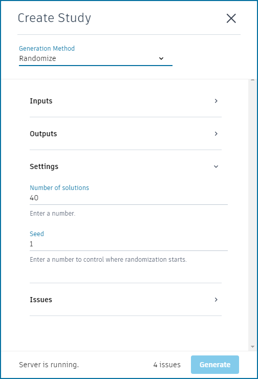
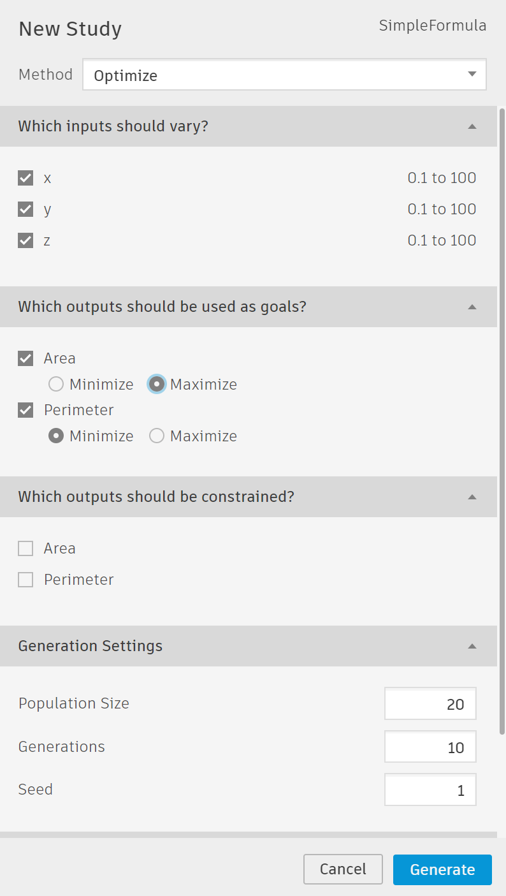

# Running Refinery

Refinery can be run using different methods. In the Refinery window you can chooses from four different Generation Methods, all of these methods are Refinery's Solvers, a further explanation of what Solvers are can be found in [section 05-04](https://github.com/martinstacey/RefineryPrimer/tree/0283ff7f125d787dfb4800dfabd3d5893bc49f45/05-algorithms/05-04_solvers.md).

## How to run an optioneering process using Refinery

An optioneering process lets you explore all possible solutions that the graph can produce. Refinery will generate the solutions based on the constraints that were defined in the Dynamo graph.

To run an optioneering process in Refinery, follow these steps:

* Launch Refinery from the Refinery menu in Dynamo
* Create a new study and select _`Randomize`_ as the generation method \([see section 05-04](https://github.com/martinstacey/RefineryPrimer/tree/0283ff7f125d787dfb4800dfabd3d5893bc49f45/05-algorithms/05-04_solvers.md)\)
* Under Inputs make sure that all the desired inputs are present
* For inputs that should not change on each run, set the desired value and uncheck the box alongside it
* Under Outputs ensure each output defined in the graph is listed  
* Under Settings choose how many options Refinery should create
* Under Settings select a random seed \(number\) to initialize the randomization
* Under Issues resolve any items
* Click Generate

## How to run an optimization process using Refinery

An optimization process lets Refinery evolve your design to find the most suitable options based on the constraints and goals provided. Refinery will run multiple generations of options and each time it will take the fittest \(best\) options of the generation and use them to create a new generation. Refinery is using [NSGA-II](https://www.iitk.ac.in/kangal/Deb_NSGA-II.pdf), an elitist multi objective genetic algorithm to optimise results.

To run an optimization process in Refinery, follow these steps:

* Open Refinery from the View Menu in Dynamo
* Create a new study and select _`Optimize`_ as the generation method \([see section 05-04](https://github.com/martinstacey/RefineryPrimer/tree/0283ff7f125d787dfb4800dfabd3d5893bc49f45/05-algorithms/05-04_solvers.md)\)
* Under Inputs make sure that all the desired inputs are present
* For inputs that should not change on each run, set the desired value and uncheck the box alongside it  
* Under Outputs go through each objective and set the optimization goal you want to achieve - Maximize, Minimize, or Ignore
* Under Settings set a population size, which represents the number of options that will be created in each generation.  
* Under Settings set the amount of generations you want to create. Each new generation is a range of options that falls between the two best designs of the previous generation
* Click Generate

