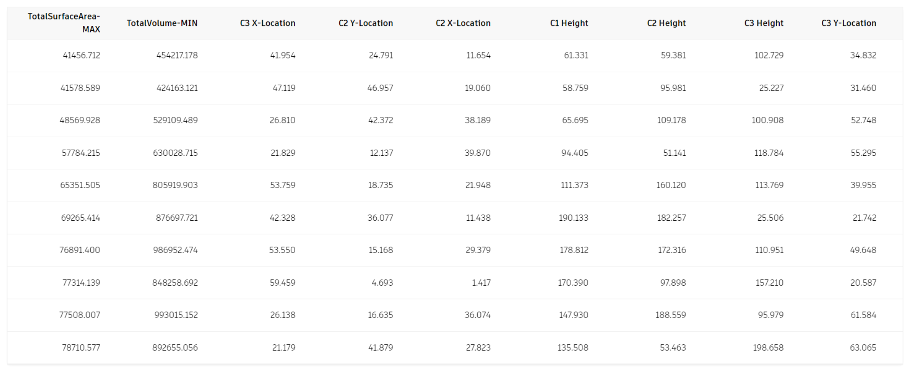

# Visualizing Results in Refinery

After Refinery has run the generative process, the results are displayed in both geometric form and through a series of charts or tables. All of the resulting views are interlinked and selecting an option in one view will highlight it in the other views currently displayed. If Dynamo is running in _`Automatic mode`_ in the background, selecting an option will also update the graph to show this design.

## Design Grid

The _`design grid`_ shows each option as a 3d geometrical thumbnail that can be individually rotated, zoomed and panned to explore the design in more detail. The order of the thumbnails can be sorted based on the inputs or outputs of the Dynamo script, with a toggle for both ascending and descending values.

## Design Table

The _`design table`_ replaces the design grid, if chosen, and lists each option in a table form with each column representing the values for the inputs and outputs.

## Scatterplot

The first chart Refinery uses to visualize data is a _`Scatterplot`_ : a type of mathematical diagram that uses cartesian coordinates to display values across a set of data. Refinery allows you to select what values are displayed along both the X and Y axis as well as which ones drive the size and colour of the circles in this 4-dimensional view. The values can be chosen from the inputs or outputs you defined in the Dynamo graph in the previous steps.

Selecting a circle from the graph space will also highlight the chosen option in the design grid or design table.

## Parallel Coordinates

The other chart available in Refinery is a _`Parallel Coordinates`_ graph. This chart show a set of vertical parallel lines, equally spaced, that represent the inputs and outputs. Each design option is represented as a polyline whose vertices sit on each parallel axis. The position of the polylines vertices on the axis corresponds to the value of the input or output.

The graph can be filtered by dragging the selection on each vertical axis.

## Choosing the right Visualization

The kind of visualization you choose for your project may vary depending on what kind of process you are running. If you are running an _`optioneering`_ process, it can be beneficial to visualize it using a parallel coordinates chart as it will be easier to filter options, while visualizing a multi-objective _`optimization`_ using a scatterplot chart will make it easier to find the best trade-off between two objectives.

