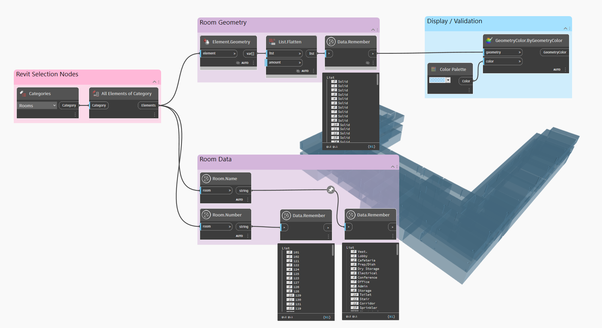
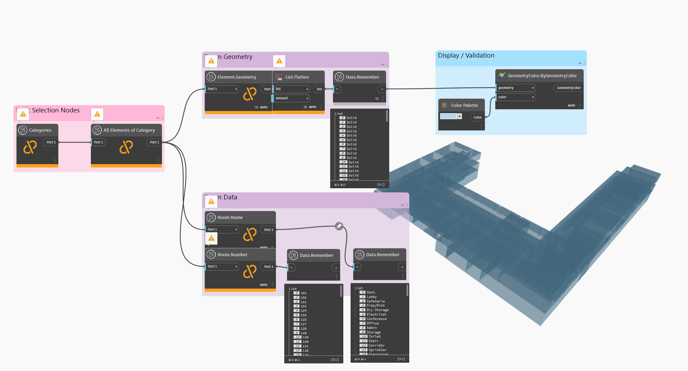

# How to test Revit data capture

A  workflow for using Revit data consists of the following steps:

* Create a graph in Dynamo for Revit (D4R)
* Use the common Revit nodes (categories, select model element etc) to pull information from Revit into Dynamo
* Add as many *Data.Remember* nodes to the canvas as needed. These nodes should be placed in between the Revit nodes and the rest of the graph. Ensure the information being passed through is of a correct data type as previously discussed. 
* Run the graph, so all nodes execute and the *`Data.Remember`* node has data passing through it
* You can now run Refinery directly from Dynamo for Revit, or run it in Dynamo Sandbox to make sure you have captured all of the data that Refinery will need to run outside of the Revit process.  To do this, follow the next steps: 
* Save the graph and close Dynamo/Revit

 

 

* Open DynamoSandbox and the graph just created
* Rerun the graph and everything upstream will become an unresolved node, however the *`Data.Remember`* node will retain the cached information

 

 

* Now Refinery can utilise the data and geometry from Revit without needing to start up Revit in the background each time
