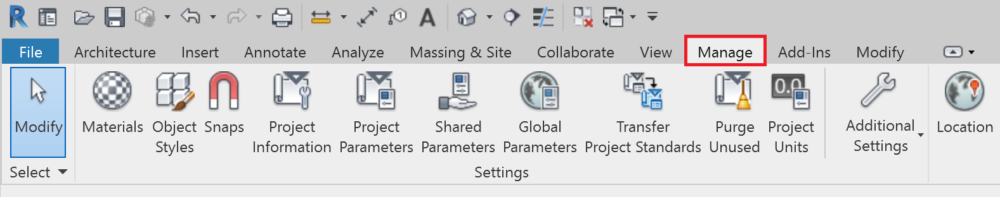
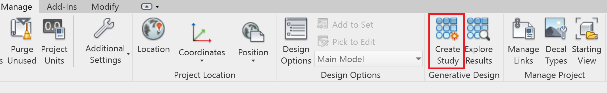
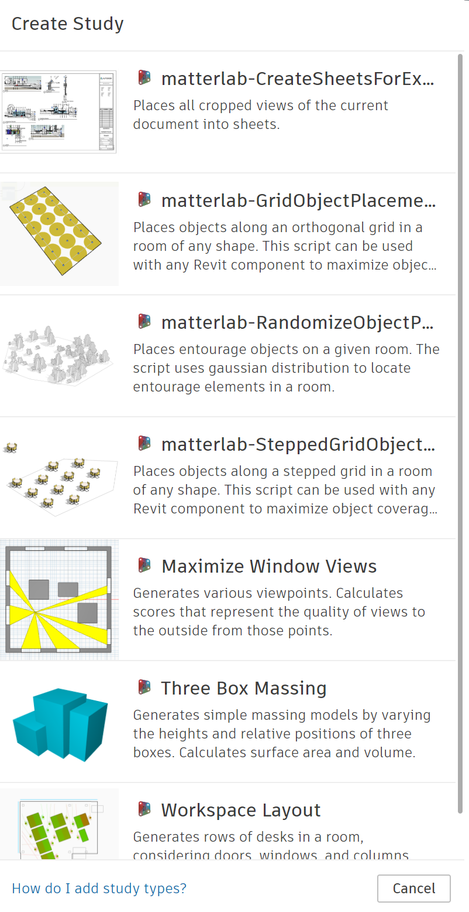
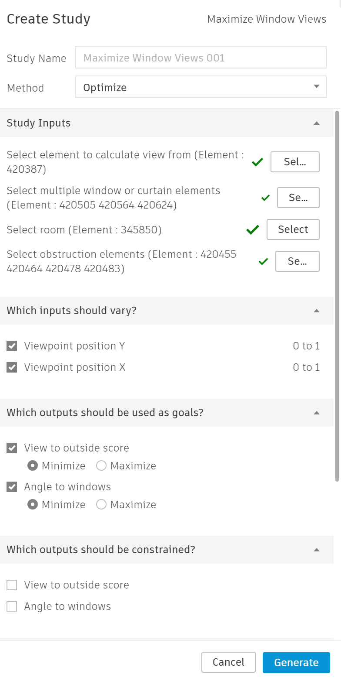
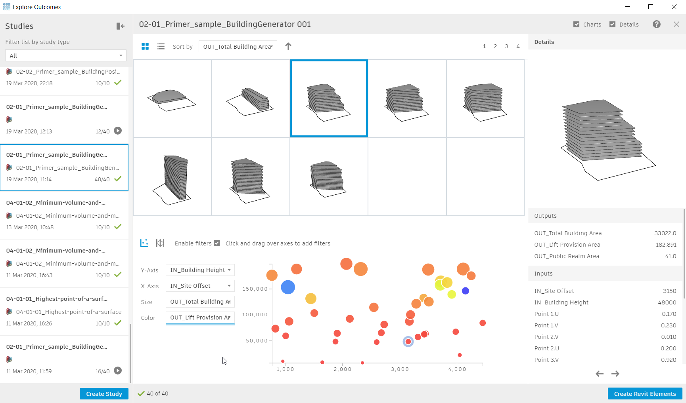

# Accessing Refinery Directly From Revit

In the Revit preview release you will find a new plugin that will let you access Refinery directly from Revit. This plugin is intended for users who are not familiar with Dynamo to be able to explore and try Refinery without needing to create their own workflows \(similar to Dynamo Player\). 

### Accessing Refinery

First, go to the `Manage` tab:

In the `Generative Design` panel there are two options, `Create Study` and `Explore Results` lets open `Create Study` to begin.

Examples of workflows previously created appear in this window. By default Refinery ships with a number of sample workflows. To proceed, select a workflow you wish to try.

Follow the instructions for each section of the dialog. If a Revit input is required, select in Revit and then return to the Create Study dialog. When selecting multiple elements be sure to hit `Finish` once you have selected all elements. 

Once all inputs are satisfied, click Generate. This will initiate Refinery and present you with the same window you will be familiar with `Create Study` from the Dynamo environment. From here you can explore all the different options through the available charts and tables. If you select a design, you can then export your results to Revit by clicking on the `Create Revit Elements` button. 

