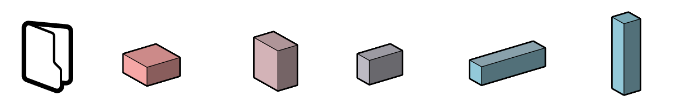

# Getting Started Workflows

<<<<<<< HEAD

The following section has simple workflows to get you started in Refinery:

* [Highest point of a surface](04-01-01_highest-point-of-a-surface.md) - [get files](https://github.com/martinstacey/RefineryPrimer/tree/02d9bb99dc69716759a793b91ff72b3deb25236a/04-sample-workflows/04-01_getting-started-workflows/04-00_sample_files/workflow1/README.md) 
* [Minimum volume and maximum surface](04-01-02_minimum-volume-and-maximum-surface.md) -  [get files](https://github.com/martinstacey/RefineryPrimer/tree/02d9bb99dc69716759a793b91ff72b3deb25236a/04-sample-workflows/04-01_getting-started-workflows/04-00_sample_files/workflow2/README.md) 

