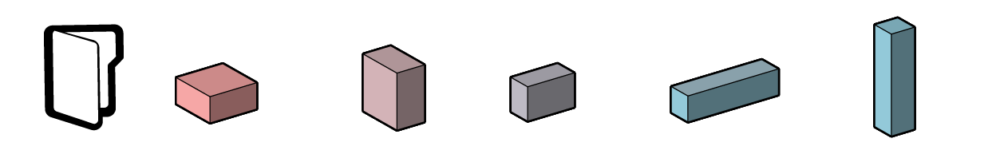

# Getting Started Workflows

The following section has simple workflows to get you started in Refinery:

* [Highest point of a surface](04-01-01_highest-point-of-a-surface.md)
* [Minimum volume and maximum surface](04-01-02_minimum-volume-and-maximum-surface.md)

[Download Getting Started workflow files](TBC) 