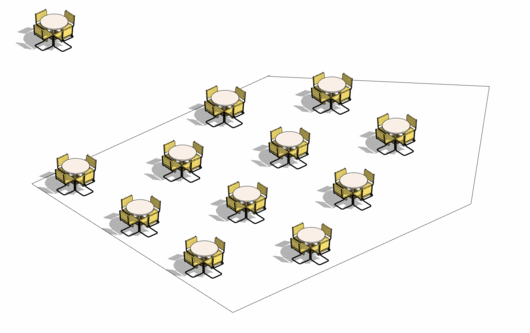
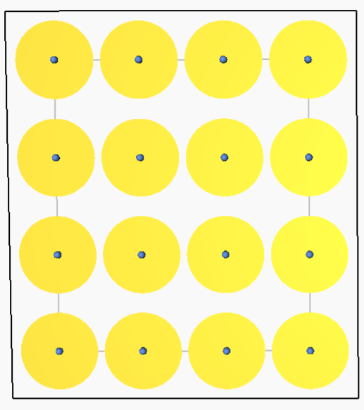
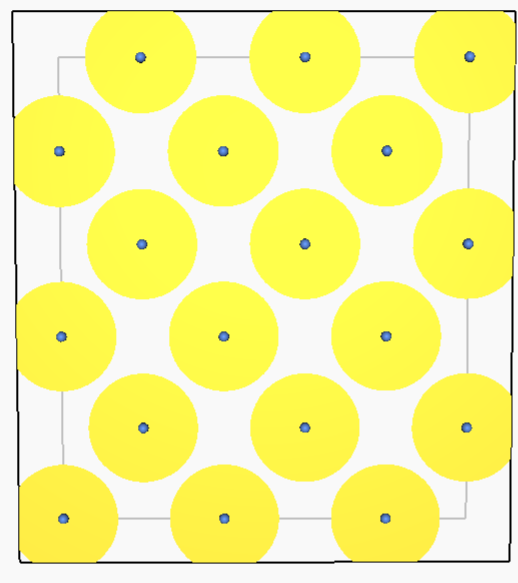
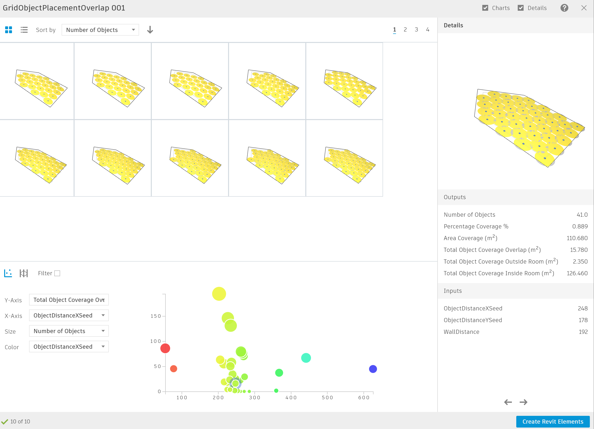

# Grid Object Placement in a Room

  

## Description

This graph uses the optimize method to place objects in a room/space using a grid/stepped grid formation. The graph will compare the percentage of total coverage, the number of objects placed and the overlap in area of object influence, as various configurations are explored through Generative Design. 

Although a simplified approach, this graph can be used as the foundation to explore more complex and personalized criteria that relate specifically to your project or practice. 

This sample file is available in the most recent version of Generative Design tool.

This workflow features two possible grid arrangements you can choose from, depending on which fits best your workflow: 
- rectangular grid
- stepped grid

## Grids

### Rectangular grid

  

With a rectangular grid, elements are aligned in both X and Y axis. This type of formation is useful when you require regularity and straight lines of circulation between elements. Typical use of this grid is for laying out items such as beds, school desks, shop gondolas, etc.  

###  Stepped grid

  

In a stepped grid, objects are not aligned by each axis to avoid a rigid x-y formation, creating a diamond pattern. This type of grid is usually used to avoid the overlap of the objects' radius of influence. The stepped grid is usually used to locate items such as tables, plants, theatre seats, etc. 

## Static Inputs

| Input | Description |
| :--- | :--- |
| Room | Room in which objects are placed |
| Radius of influence | Object radius of influence for optimization calculation |
| Minimum distance to wall | This sets a minimum value for the random seed to determine the distance from the object grid to the wall |
| Maximum distance between objects | This sets a maximum value for the random seed to determine the distance between objects within the grid |

Constraints for radius, minimum, and maximum values can only be changed using Dynamo.

## Variable Inputs

| Name | Description |
| :--- | :--- |
| Wall distance \(seed\) | Gives a random value for the separation of the grid start to the wall. This value is constrained by the minimum and maximum distances to wall in the static input. |
| Object distance X \(seed\) | Distance in between objects in the grid's X-axis. This value is constrained by the minimum and maximum distances between objects in the static input. |
| Object distance Y \(seed\) | Distance in between objects in the grid's Y-axis. This value is constrained by the minimum and maximum distances between objects in the static input. |

## Graph Description

The graph is made up of a series of functions, which are divided into groups inside the graph. Each group has a name and a short description, where the name indicates the type of function being run and the description explains the process in more detail.

This graph will input a model element, a room and variables for placing a grid. The rooms surface and perimeter are used to calculate further metrics. Next, random values are assigned for the wall distance between the wall and the beginning of the grid, and the grid X- and Y-axes separations. 

These values are used to create points along the room. The graph then determines how much each object's area of influence overlaps with one another, and with the perimeter of the room.

Using optimization, the object's coverage and number of objects is maximized while the total object overlap is minimized.

## Evaluators

| Name | Description |
| :--- | :--- |
| Percent Coverage \(%\) | Percentage of room covered by the object's radius of influence |
| Area Coverage \(m²\) | Total area covered by the object's radius of influence |
| Number of Objects \(u\) | Number of objects placed in the room |
| Internal Object Overlap \(m²\) | Internal object overlap |
| External Object Overlap \(m²\) | External \(perimeter\) object overlap |
| Total Object Overlap \(m²\) | Total overlap of both internal and external objects |

## Results

Explore Outcomes will display various grid configurations. In this example, you can see results in the X- and Y-axes,  according to their X and Y seed. Each result is displayed as a point, where the point’s size is determined by the number of objects of each result.

Once generation has finished, the results can be explored through the tables and graphs in the Explore Outcomes dialog. The image below shows an example output from an optimized study based on four generations with a population of 20.

## Video Tutorial




