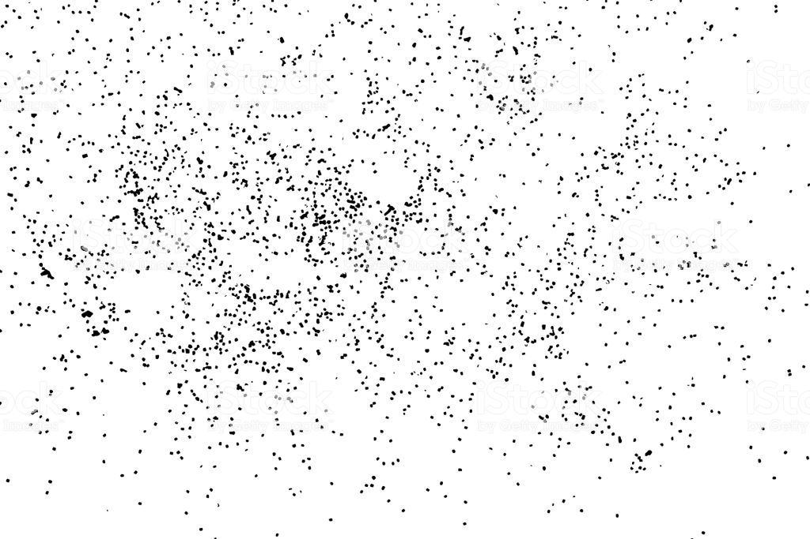

# Entourage Placement Exploration

## Description

This graph will generate a series of scenes with different entourage elements. Entourage elements are placed in clusters that imitate the organic positioning of random elements within a space. 

Begin by selecting a space/room, then the entourage elements \(people, trees, etc\). After that, set your different cluster constraints, and finally review the metrics related to how these elements relate to each other.

This workflow is intended to be used with `randomize` . Because of this, no optimization criteria is needed however some outputs are provided to give a better view of \(some of\) the attributes of each scene. 

With this workflow you ca save time by quickly generating multiple scenes without having to manually place each element.

The sample files for this example can be found in the `PROVIDE LINK` folder in the Github repository.

## Static inputs

| Name | Description |
| :--- | :--- |
| Room | Room in which the entourage will be placed |
| Families for entourage | Family instance for each element you want to include in your entourage |
| 3D view | 3D view \(or perspective\) you'll be working in |

## Constraints

| Name | Description |
| :--- | :--- |
| Min/Max cluster count | Range for number of clusters |
| Min/Max spacing per cluster | Range of spacing per each cluster |
| Min/Max elements per cluster | Range of number of elements per cluster |

## Variable inputs

| Name | Description |
| :--- | :--- |
| Seed cluster count | Determines amount of clusters |
| Seed cluster Us/Vs | Determines UV position of each cluster |
| Seed spacing in cluster | Determines spacing for each cluster |
| Seed elements per cluster | Determines amount of elements in each cluster |
| Seed element location | Determines element location per cluster |

## Functions

The script is made up of a series of functions, which are divided into groups inside the graph. Each group has a name and a short description. The name indicates the type of function being run and the description explains the process in more detail.

The script will begin by extracting the surface of a room. This room will be used for placing the entourage elements. Then, it'll continue to create a series of clusters of elements. After that, it'll filter and place only the elements that are inside the designated room, before continuing by randomly assigning a family instance to each point. Metrics will be calculated relating the new family instances and the point of interest.

## Visualization

Generative Design will display the surface of the room selected, the point of interest and the entourage elements as lines. We suggest you combine this with the 3d view used so that you get results as you export them to Revit.

## Evaluation

There is no optimization in this example, however some metrics will provide information on the scenes you've created.

| Name | Description |
| :--- | :--- |
| View obstructions | Size and proximity of elements to your camera. |
| Number of elements | Number of elements created in the scene. |
| Overall spacing | Distance between elements in the scene |

## Results

Once Generative Design has completed, the results can be explored through Generative Design's tables and graphs.  

The image below shows an example output from a randomized study based on 40 solutions.

## A More Organic Random Using Gaussian Distribution

One of the key elements to understand when placing elements randomly is Gaussian distribution. 

By using Gaussian normal distribution instead of the regular, randomized method you can control the clustering of elements so that your placement will feel more organic.

For further reading on this, please refer to the following website:

* [https://natureofcode.com/book/introduction/](https://natureofcode.com/book/introduction/) 

