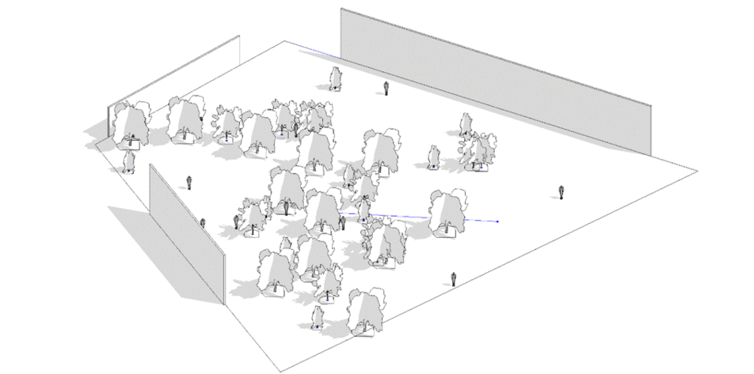
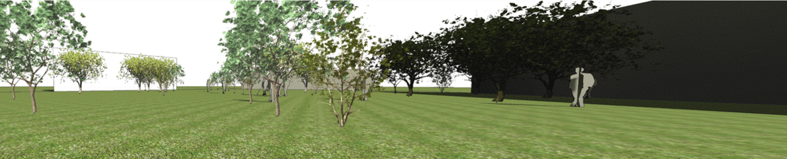
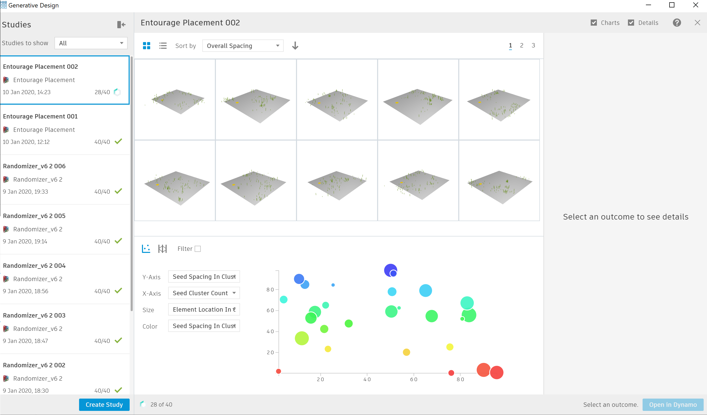

# Workflow 5 : Entourage Placement Exploration

## Description

  

This graph will generate a series of scenes with different entourage elements. Entourage elements are placed in clusters that imitate the organic positioning of random elements within a space. You start by selecting a space/room, you select entourage elements, \(people, trees, etc\) then set different cluster constraints, and you finally review metrics related to how these elements relate to each other.

This workflow is intended to be used with `randomize` so no optimization criteria is needed, but some outputs are given to achieve a better perception of some of the attributes of each scene. With this workflow you are able to save time by quickly generating multiple scenes without the need for manually placing each element individually.

_The sample files for this example can be found in the  `PROVIDE LINK` folder in the Github repository._ 

## Static inputs

| Name | Description |
| :--- | :--- |
| Room | Select a room to place the entourage |
| Families for Entourage | Select one family instance for each element you want to include in your entourage |
| 3d View | Select a 3d view/Perspective you would be working in |

## Constraints

| Name | Description |
| :--- | :--- |
| Min/Max cluster count | Range for amount of clusters |
| Min/Max spacing per cluster | Range of spacing per each cluster |
| Min/Max elements per cluster | Range of amount of elements per cluster |

## Variable inputs

| Name | Description |
| :--- | :--- |
| Seed cluster count | Determines amount of clusters  |
| Seed cluster Us/Vs | Determines UV position of each cluster |
| Seed Spacing in Cluster | Determines spacing for each cluster |
| Seed Elements per cluster | Determines amount of elements in each cluster |
| Seed Element location | Determines element location per cluster |

## Functions

The script is made up of a series of functions, which are divided into groups inside the graph. Each group has a name and a short description. The name indicates the type of function that is being run and the description explains in more detail the process. 

The script would start by extracting the surface of a room. This room would be used to place the entourage elements. Then, it would continue to create a series of clusters of elements. It would then filter and place only the elements that are inside the designated room. The script would continue by randomly assigning a family instance to each point. Metrics will be calculated relating the new family instances and the point of interest. 

## Visualization

Refinery will display the surface of the room selected, the point of interest and the entourage elements as lines. We suggest you combine this with the 3d view used so that you get results as you export them to Revit.

## Evaluation

There is no optimization but some metrics give you information of the scenes created.

| Name | Description |
| :--- | :--- |
| View obstructions | The size and proximity of elements to your camera. |
| Number of elements | Number of elements created in the scene. |
| Overall spacing | How far apart are elemets to each other |

## Results

Once Refinery has completed, the results can be explored through the available tables and graphs   
 The image below shows an example output from a randomized study based on 40 solutions.

## A More Organic Random Using Gaussian Distribution

One of the key elements to understand when placing elements randomly is Gaussian distribution. By using Gaussian normal distribution instead of the regular random method you can control the clustering of elements and your placement would feel more organic. 

For further reading on this subject please refer to the following link:

* [https://natureofcode.com/book/introduction/](https://natureofcode.com/book/introduction/) 
