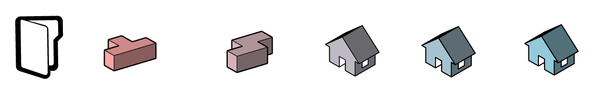

# Generative Design Example Workflows

This section will explore a series of workflows related to architecture.

* [Building mass generator](04-02-01_building-mass-generator.md)
* [Building positioning based on solar analysis](04-02-02_building-positioning-based-on-solar-analysis.md)
* [Office layout](04-02-03_office-layout.md)
* [Grid object placement](04-02-04_grid-object-placement.md)
* [Entourage placement exploration](04-02-05_entourage-placement-exploration.md)

[Download Architectural workflow files](https://github.com/DynamoDS/RefineryPrimer/releases/download/samples-v1/04-02_architectural-workflows.zip) 

