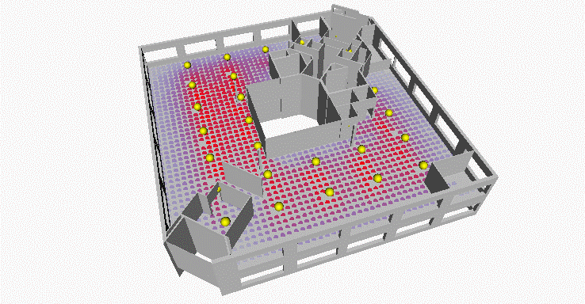

# Workflow 3 : Create office layout

  

## Description

This graph used refinery on optimize mode to place a number of lights in a hypothetical office layout to optimize light distribution by minimizing both unlit spots and overlit spots within the space. 
The graph works by calculating unobstructed distances from light sources to an evenly distributed series of analisis points within a selected floor.
All sample files for this example can be found in the [03-01_Distributing_flights](https://github.com/martinstacey/RefineryPrimer/tree/ContentBranch/04-sample-workflows/04-00_sample_files/04-00-03_mep/03-01_Distributing-lights) folder in the Github repository

## Static inputs

| Name  | Description |
| :--- | :--- |
| Obstacles | Select the floor geometry  |
| Room | Select Revit room you wish to perform lighting calculation |
| Light Power | Maximum distance (mm) a ray can cast |
| Grid Size (mm)              |  Grid of analysis points on which the lighting calculation would be performed. (A smaller grid would result in a more accurate but slower calculation) |

## Variable inputs

| Name    | Description |
| :--- | :--- |
| U value | U Parameters for location of 4 lights along selected room |
| V value | V Parameters for location of 4 lights along selected room |

## Functions

The script is made up of a series of functions, which are divided into groups inside the graph. Each group has a name and a short description, where the name indicates the type of function that is being run and the description explains in more detail the process.
The graph places an evenly distributed number of analysis points within the floor of the room selected. It also places a grid of light sources along the ceiling of the room. U and V values for each of the lights defines the location of each grid within the room.  A ray records the distance from each light source to analysis point, each analysis point is colored according to the total amount of light recieved by all light sources. The ray trace is only considered if no geometries obstruct its way.  
Both underlit and overlit analysis points are minimized through refinery using optimization.

## Visualization

When geometry is created in Dynamo, often other geometry is needed to facilitate the overall process. To ensure the geometry displayed shows the final geometric output, all unnecessary geometry has been switched off. Any nodes with the preview switched off will not display the output visually in Refinery. In this case, only the main building and the resulting solar analysis will be visible. The solar analysis is represented on the external surfaces of the building as a colored grid of points. These points are colored from yellow to red to indicate a low amount of incidence and a amount of incidence respectively.

## Evaluators

| Name   | Description |
| :--- | :--- |
| Underlit spots | Amount of underlit analysis points  |
| Overlit spots    | Amount of overlit analysis points |

## Benefits of Using Refinery

Without the aid of refinery the designer would usually place light sources evenly distributing them along spaces to later perform lighting calculations. In regular shaped rooms this method produces good results but things can get complicated if  rooms have irregular shapes that may result in blind spots. Refinery using an optimization method can speed up how light sources are distributed.  

## Results

Without the aid of refinery the designer would usually place light sources evenly distributing them along spaces to later perform lighting calculations. In regular shaped rooms this method produces good results but things can get complicated if  rooms have irregular shapes that may result in blind spots. Refinery using an optimization method can speed up how light sources are distributed. 

 
The image below shows an example output from a randomized study based on 35 solutions.

 

