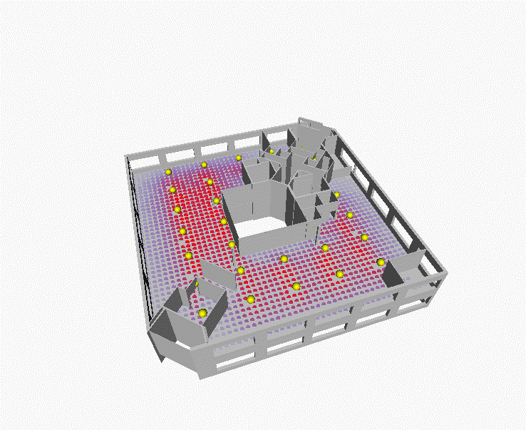
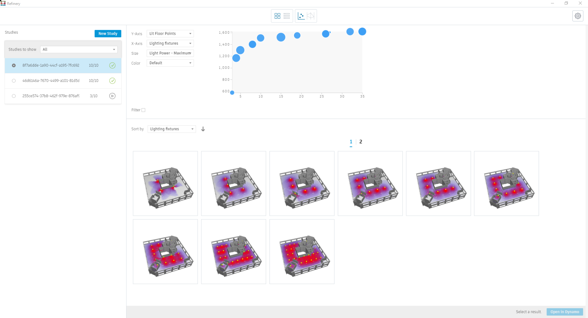

# Distributing Spotlights in an Office Space

## Description

This graph used Generative Design on `optimize mode` to optimize light distribution in a hyptothetical office layout by minimizing both the number of lighting fixtures and overlit points, but simultaneously maximizing the number of lit points on the floor surface within the space. 

The graph works by calculating unobstructed distances from light sources to an evenly-distributed series of analysis points within the floor of the selected Revit room.

[Download workflow files](https://github.com/DynamoDS/RefineryPrimer/releases/download/samples-v1/04-03-01_Distributing-lights.zip).

## Static Inputs

| Input | Description |
| :--- | :--- |
| Obstacles | Revit model to pull obstruction geometry - this checks possible geometries \(walls, columns, curtain panels, etc.\) that may interfere with light rays. |
| Room | Selected Revit room for the lighting calculation |
| Light Power \(mm\) | Maximum distance a light ray can cast |
| Grid Size \(mm\) | Grid of analysis points for the lighting calculation \(a smaller grid would result in a more accurate but slower calculation\). |

## Variable Inputs

| Name | Description |
| :--- | :--- |
| Lighting max width distance \(mm\) | Maximum distance between lighting fixtures on the X-axis |
| Lighting max length distance \(mm\) | Maximum distance between lighting fixtures on the Y-axis |
| Light power \(mm\) | Maximum distance a light source can reach |

## Functions

The script is made up of a series of functions, which are divided into groups inside the graph. Each group has a name and a short description, where the name indicates the type of function being run and the description explains the process in more detail. 

The graph places an evenly-distributed number of analysis points within the floor of the room selected. It also places a grid of light sources along the ceiling of the room, defined by the variable inputs. A ray records the distance from each light source to its analysis point, and each analysis point is colored according to the total amount of light received from all light sources. The ray trace is only considered if no geometries obstruct its way.

Using optimization, the number of light sources and the overlit analysis points are minimized while the overall number of lit points within the room are maximized.

## Visualization

When geometry is created in Dynamo, often other geometry is needed to facilitate the overall process. 

Please note that all unnecessary geometry has been switched off in Dynamo - this is to ensure the geometry displayed shows the final geometric output. Any nodes with the preview switched off will not display the output visually in Generative Design. 

In this case, only the obstructing geometry, light sources and final coloured analysis points will be visible. The analysis points are coloured from blue to red, where blue indicates that the points are less illuminated and red indicates they are more illuminated.

## Evaluators

| Name | Description |
| :--- | :--- |
| Light sources | Number of light sources/fixtures resulting on the room |
| Lit spots | Number of overall illuminated analysis points |
| Overlit spots | Number of overlit analysis points |

## Benefits of Using Generative Design

Without Generative Design, the designer would usually place light sources by evenly distributing them along spaces and performing lighting calculations later. In regular-shaped rooms, this method is straightforward, however if the rooms shapes are irregular then it can become complicated and result in blind spots. 

Using Generative Design, the optimization method can speed up how light sources are distributed.

## Results

Once Generative Design has finished, the results can be explored through the available tables and graphs. 

The image below shows an example output from an optimized study based on ten generations with a population size of 20. The outputs were defined as minimized for both _`underlit spots`_ and _`overlit spots`_.

## Acknowledgements

We want to thank Jared Linden Digital Applications Developer at Hoare Lea for contributing this workflow to this document.

