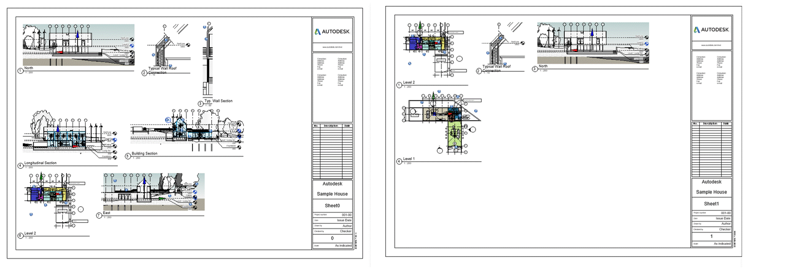
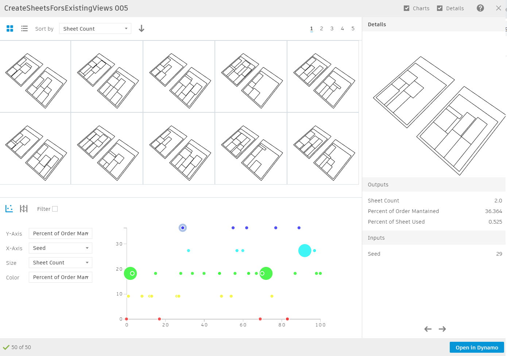

# Placement of views on sheets

  

## Description

The following graph takes all cropped views from the current Revit document and places them onto sheets. It creates all the sheets needed to accommodate existing cropped views, and then generates different options for the ways the views can be laid out. By using Generative Design, we are able to find solutions that minimize the number of sheets and reduce the amount of whitespace.

\[Download workflow files\]

## Static inputs

| Name | Description |
| :--- | :--- |
| Sheet Tittle Block | Input the desired title block that will be used in each sheet created |
| Sheet Margins \(right, left, top, bottom\) | Define the margins within the title block that determine the available sheet area where you can place viewports. These 4 parameters are given to avoid placing viewports on top of tittle blocks. |
| Viewport Margin | The individual margin for each viewport \(right, left, top and bottom are equal\) |

## Variable inputs

| Name | Description |
| :--- | :--- |
| Shuffle seed | An index that will shuffle the viewport order of placement |

## Functions

The script is made up of a series of functions, which are divided into groups inside the graph. Each group has a name and a short description, were the name indicates the type of function that is being run and the description explains in more detail the process.

The graph collects all the views from the selected view types that have been cropped, before extracting their dimensions and adding a margin to them. It also takes a default title block and based on the margins specified as inputs, calculates the area where the views are going to be placed. It shuffles the order of the views and begins placing them onto the sheet starting from the top left corner. The placement direction is horizontal from left to right, adding as many rows as can be fitted in each sheet. When there is no more space on a sheet it generates another one and continues with the placement until all the views have been placed on the sheets.

Once all the views have been placed on sheets, the script evaluates the design based on the number of sheets created, the leftover free area in those sheets and how suitable the order of the views is.

## Evaluators

| Name | Description |
| :--- | :--- |
| Number of sheets | The total number of sheets created to accommodate all views |
| Sheet space not occupied | Percentage of the space left free in the generated sheets |
| Order percentage | Percentage measuring how good is the order in the shuffled list of views |

## Benefit of using Generative Design

Without the aid of Generative Design, running this script in Dynamo, the user would be required to manually reorder the list of views until they manage to find the desired layout. This process, unless incredibly lucky, would take hours. As the aim is simple, to find the best arrangement for the views maximizing the space used in the sheets, Generative Design can be leveraged by using the Optimize approach. The shuffle seed included in the script helps Generative Design keep record of the best shuffled option and optimize the results from there.

## Results

Once Generative Design has completed the study, the results can be explored through the available tables and graphs. The image below shows an example output from a randomized study based on 50 outputs. Although this graph would usually be used under optimization criteria, in this case a randomize method was used to display the variety of  results that the script may produce. From the graph below you can see that most results require 2 sheets \(represented as small circles\) but some require 3 sheets \(big circles\). The Y axis represents how well ordered the views are placed. 

