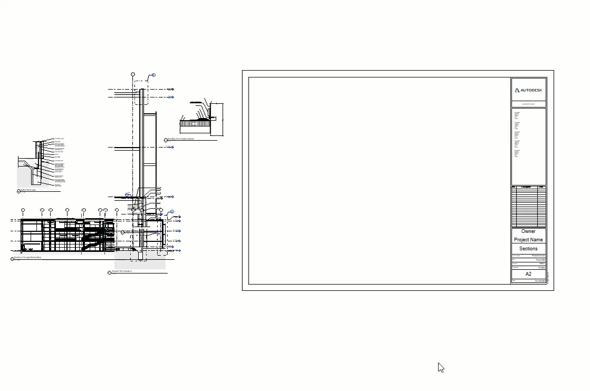
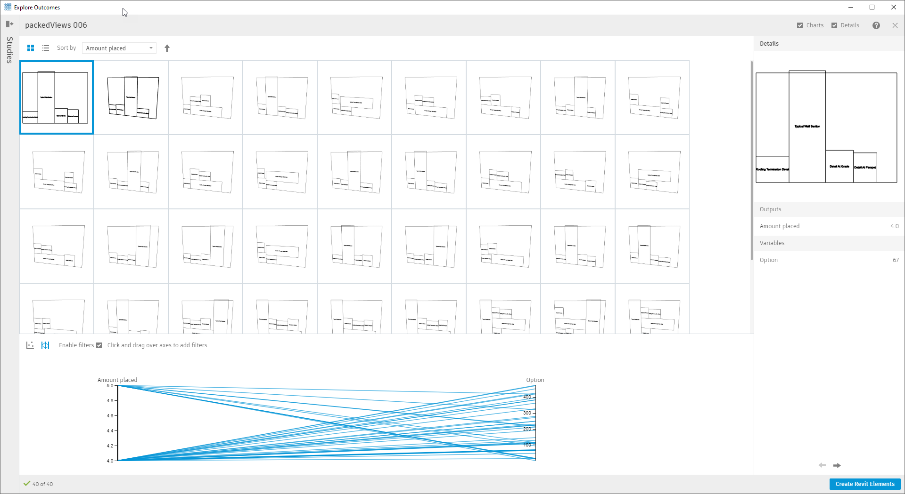

# Option Generation of Viewports on Sheet

  

## Description

This graph takes all of the placed viewports on a sheet and generates options for laying out that sheet. This includes previews in Generative Design for View Names and viewport bounding box. In Revit 2022, this workflow also considers the viewport titles and fixes those. 

[Download workflow files](04-05-00_Example-files\BIM_ViewportOptionCreation\packedViews.zip).

## Variable inputs

| Name | Description |
| :--- | :--- |
| Select Sheet | The sheet to generate options for |
| Option | This is the seed value to perform the option creation |

## Functions

The graph is made up of a few functions to make this possible. Each function has an explanation of what it is contributing to the overall workflow.

In order to perform viewport layout, the graph extracts the titleblock boundary and adds a buffer (specified in the Dynamo graph) to perform layouts within.

With this outer boundary created the graph will perform rectangle packing from the bottom left corner.

## Evaluators

| Name | Description |
| :--- | :--- |
| Amount Placed | Total number of viewports that were placed during this iteration |

## Benefit of Using Generative Design

This graph is unique because it is truly using Generative Design to aid the Revit user in making decisions. Before running this graph the user needs to place views on the sheet that they want to perform layouts upon. With this data, Generative Design creates a few results for us to parse through. When we are satisfied we simply select the result and select "create Revit elements".

## Results

Once generation has finished, the results can be explored through the  tables and graphs in the Explore Outcomes dialog. 

The image below shows an example output for a sections sheet within Revit.

## Video Tutorial



