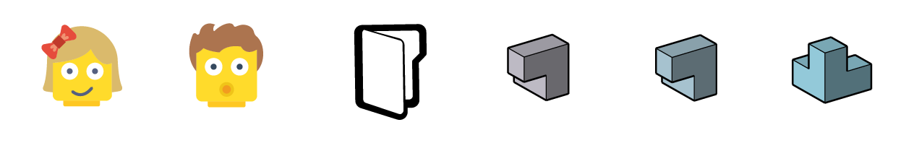

# Community Examples

In the future we want the community to submit their generative design case studies to this primer. This chapter will showcase these workflows so they will be available as examples for the wider generative design & Refinery community.

The submitted case studies should show the process from start to finish and highlight the benefits of working with generative design.

> Lego Heads: Icons made by Smashicons from www.flaticon.com