# Optimizing Umbrella Orientation

Since the introduction of Generative Design in Revit (GDIR), we have been able to communicate with Revit models in really great ways.

  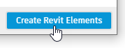
 
With this ability to read and write, we gained a new button on the GDIR window.

 
 

Generally speaking, we have seen this button is used when one wants to *place* Revit elements in the active document.

However, this button represents much more than placing elements. It is essentially an option to make a Revit transaction **wait** until we tell it to **commit.** In Revit, any change to the Revit file is considered a transaction. 

### Revit Transaction Overview

Revit transactions can be conceptualized in the same manner they obtain their namesake from. Consider buying a candy bar at a candy store. 

For you to complete your purchase of a candy bar, you have to do the following:

---

1. Make up your mind of what you want to buy (or do).

2. Start the transaction with the cashier.

3. Within this transaction certain things take place. Including, finding out the total cost, handing over the money, ringing up the item.

4. When all of that is done, we finish/close out the sale, (commit the transaction).

    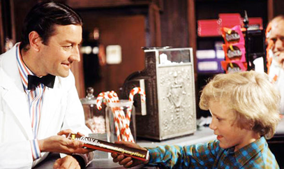
    
Charlie knows all about transactions!

---

This exact process applies to Revit. We start a transaction, do some stuff and commit it. In a nutshell, the `Create Revit Elements` button queues this for us.

There are quite a few nodes that make changes to Revit, *(too many to cover here)*. Below you will find a non-exhaustive list of nodes with Transactions embedded in them.

    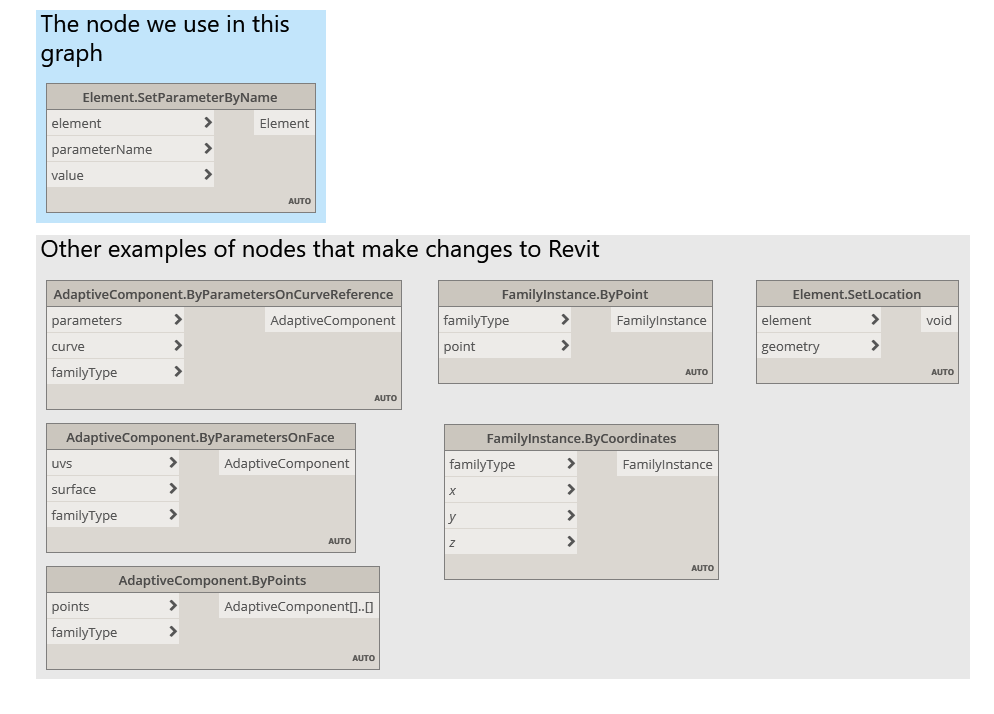
    
Nodes with transactions

For our purposes, we would like to focus on the nodes `Element.SetParameterByName` and `Data.Gate` as this is what enables our umbrella orientation to wait until we are ready.

The Gate node is very special because it is controlled by the previously mentioned `Create Revit Elements` Button. It essentially allows us to leave Revit in read only until we are ready for the changes to happen.

    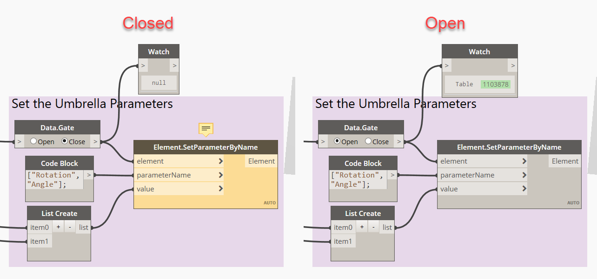
    
The gate node with the two options

### Revit Family Logic

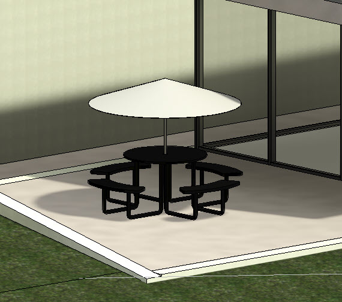

To get started with this process, we need a family that has parameters we can set. 

Included in this sample is a Table family with parameters for the following.

- **Angle** - The angle for the umbrella to tilt. (values bound from -20° to 20°
- **Rotation** - Since we have the angle built in, we can also rotate the umbrella from 0° to 360° *(this parameter also supports greater values without breaking)*
- **Top of Umbrella** - this is essentially the umbrella height.

Within the family we also have logic for extracting the analysis surfaces vs the shading surfaces. This is achieved through the geometry display options.

<table style="width:100%">
<tr>
<th>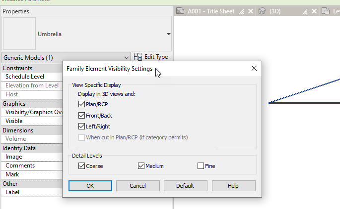</th>
 <th>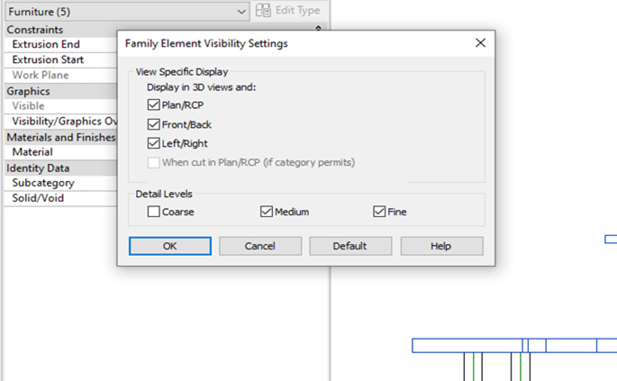</th>   
</tr>
<tr>
<td>The umbrella canopy (shading surfaces) display in Coarse and Medium display levels</td>
<td>The table seating/top surface (analysis surfaces) display in Medium and Fine Settings.</td>
</tr>
</table>
 
 

This is useful because in Dynamo we can utilize custom packages to be selective with our geometry collection.

    
    
Custom package Clockwork contains Geometry extraction nodes

## Let's quickly summarize the rest of the logic in our graph.

    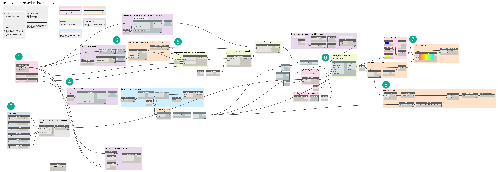

 

1. Provide our user with inputs to use within GDIR

2. Construct a datepicker that generates a dateTime object from a string. (also user inputs, but not for GDIR optimizations) **NOTE: This is not necessary for Generative design, but an example of using inputs for other things as constraints.**

3. Obtain our shading surface (canopy of umbrella).

4. Retrieve our analysis surfaces (tabletop and seating).

5. Build the "rig" for the canopy. Angle and rotation parameters.

6. Build the solar analysis with the appropriate inputs. (Site location, shading surfaces, analysis surfaces, date, spacing and rotation of project)

7. Visualize results in Dynamo/GDIR

8. Provide results as tangible data for GDIR to optimize

9. Set the parameters when the user is finished with the optimization and clicks the `Create Revit Elements` button mentioned at the beginning of this post.

## Running our Workflow in GDIR

First we set our variables and constraints and run the workflow:
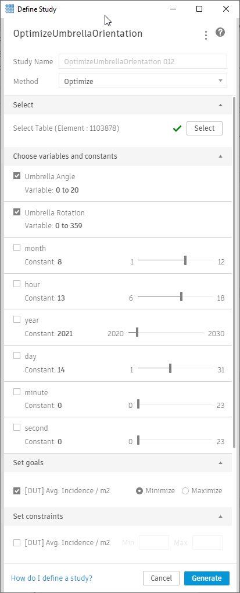

Once our run is complete, we will have the ideal angle/rotation for the given time of day on the given date.
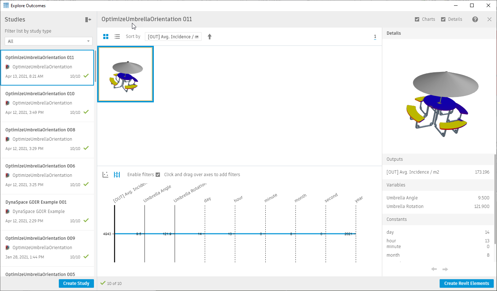

And we can finally click the "Create Revit Elements" button.
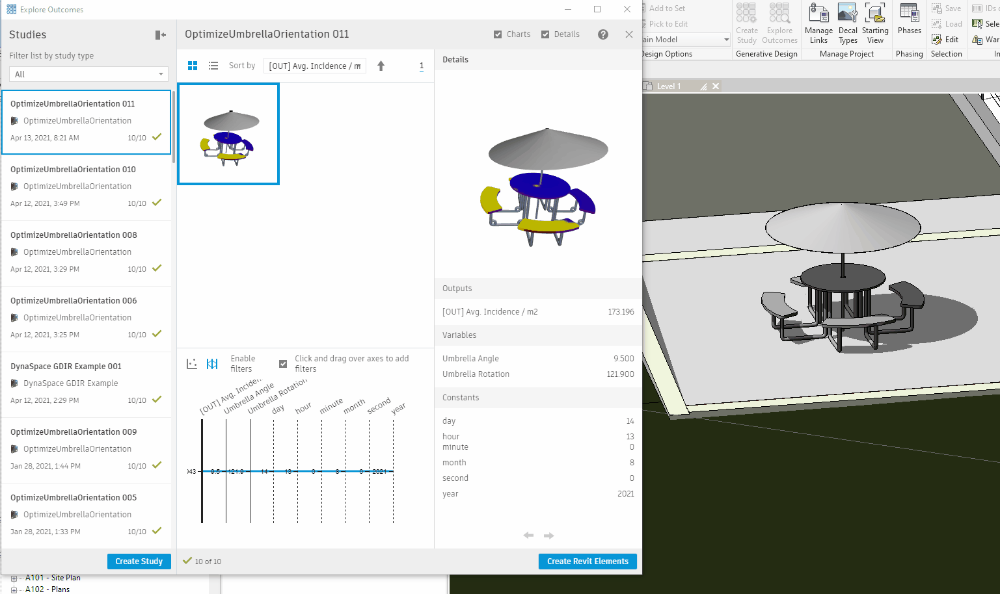