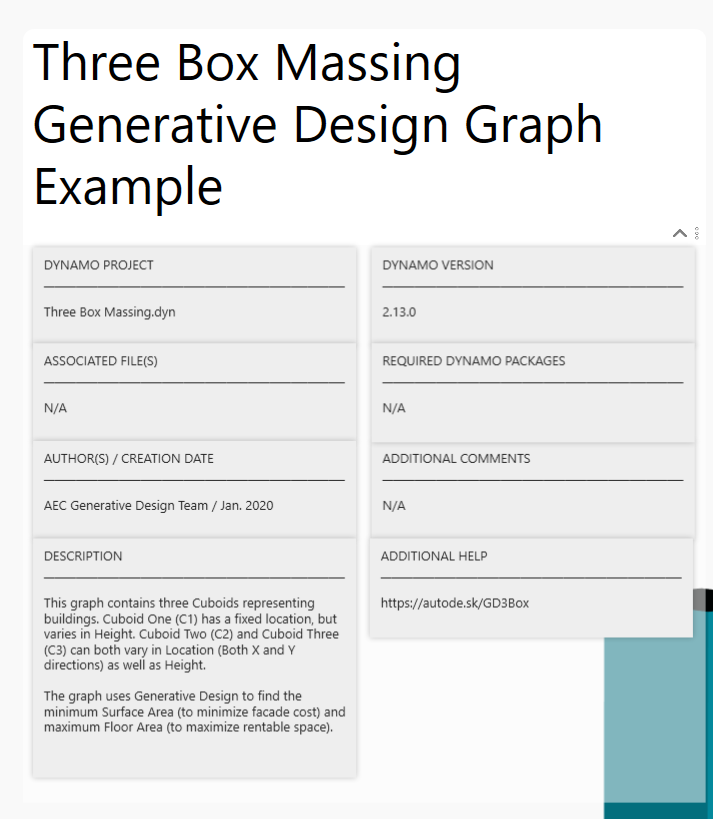
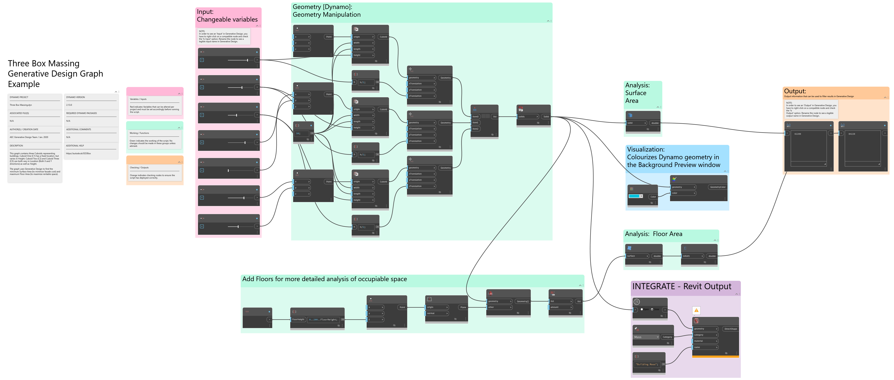
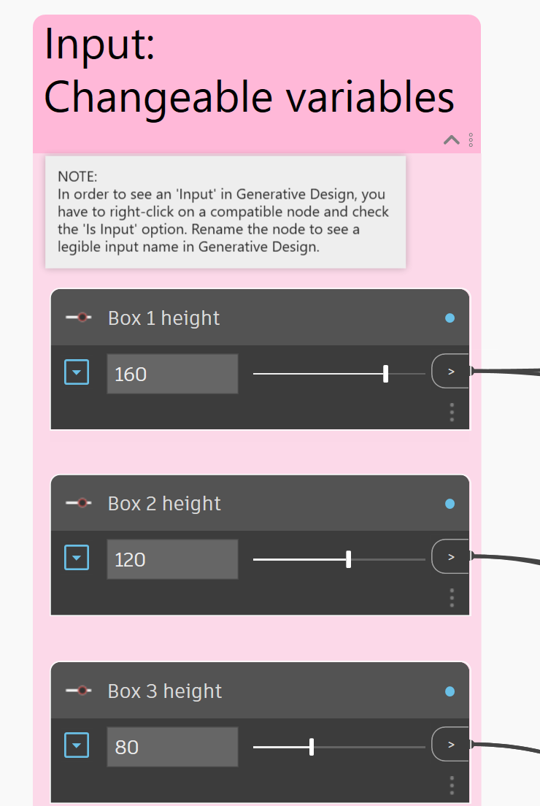
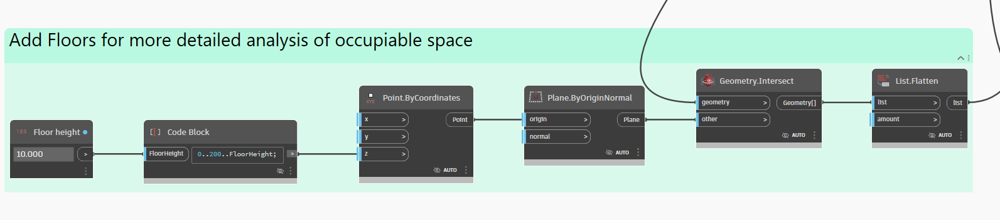
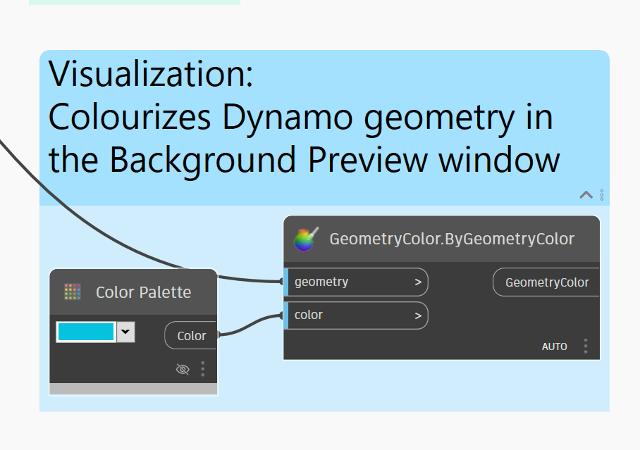
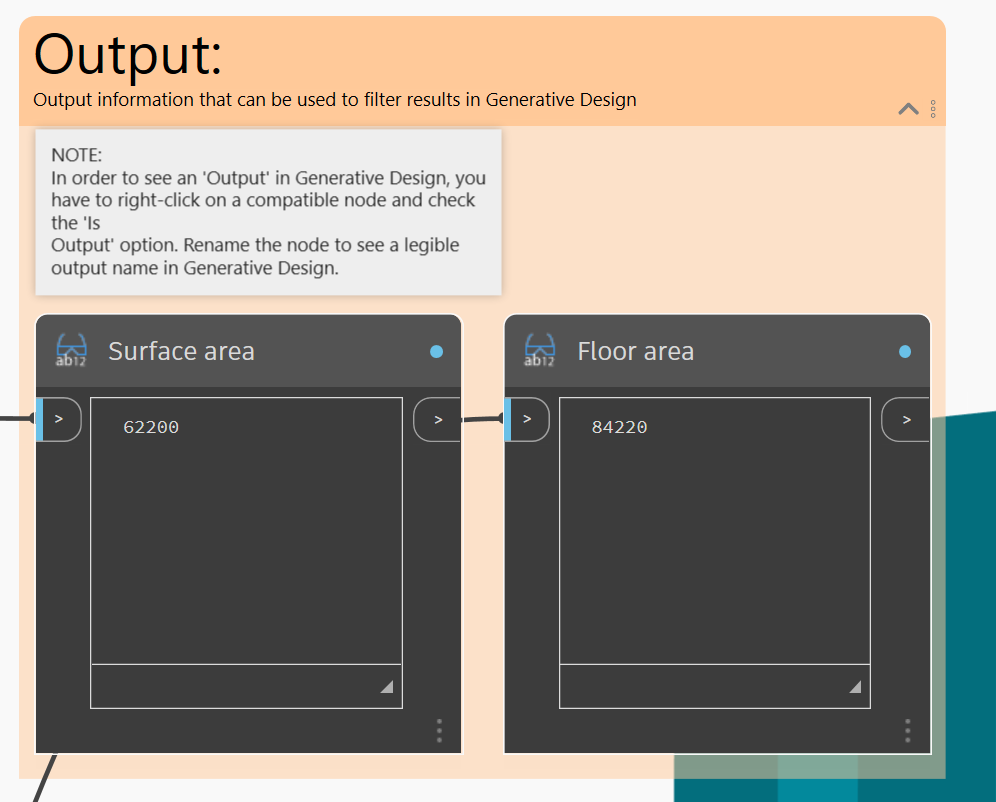
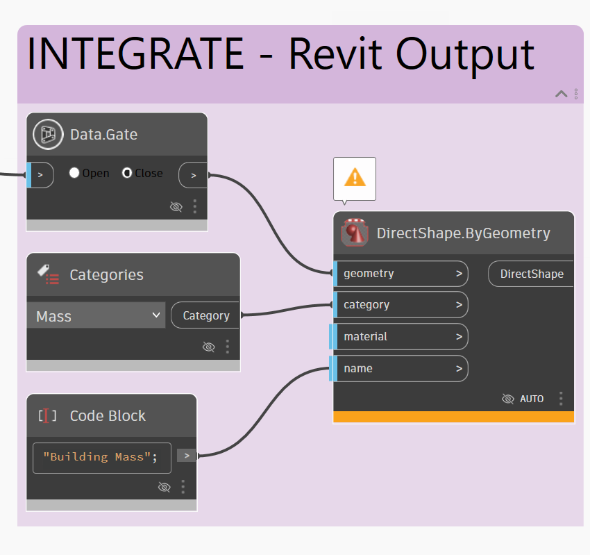

# Guidelines

## Submitting Changes on the Primer

If you have any suggestions for the primer, we will gladly review them. To do so, please follow the guidelines in the following link:

[https://github.com/DynamoDS/RefineryPrimer/blob/master/CONTRIBUTING.md](https://github.com/DynamoDS/RefineryPrimer/blob/master/CONTRIBUTING.md)

## Submitting Examples

If you have an example please create a Pull Request in GitHub containing your workflow. Follow these steps: 

#### **1. Upload files:** 

* Place all necessary files for your workflow in a zip file, this zip file should be named using the following format: Author's last name \(Uppercase, 3 first letters\) + Short descriptive name of workflow Example:`RAH_FloorsFromSolarAnalysis.zip`
*  All files should be named using the same format. Example:  `RAH_FloorsFromSolarAnalysis.dyn`.
* Create a pull request by adding this zip file to the following folder:`04-sample-worflows/04-06_Community-Examples/04-06-00_Community_Examples`
* Make sure your file runs on the last version of Refinery and Revit. 
* You should include: 
  * Dynamo file
  * Brief Description
  * Revit file in last available version \(optional\)
  * Video tutorial \(optional\)
  * In-depth description in PDF format \(optional\)

#### 2. Create Brief Description

* In the zip file described above create a folder titled: `Description`
* Add a brief description and an image to this folder.
* The image should be:
  * Format: `.png` format
  * Size: Width 720 px Height 300 px
* The brief description should include: 
  * Tittle of workflow
  * Author of script
  * Required dynamo packages to run script
  * Description of how the workflow works and why it is useful.
  * Descriptive Image of workflow \(Optional\)
  * Links to files uploaded in the `Example_Files` folder.
* Check the first workflow example \(High Performance Building Design Based on Daylight Analysis\) as a reference on how to upload files. 

## Dynamo Files Basic Guidelines

To ensure that all sample files presented in this page are easy to understand, we recommend you follow these general guidelines:

### Create a Title Block

This title block will help the user identify all the requirements needed to run the workflow \(Revit version, required dynamo packages, etc.\). The title block will also display observations that help explain what the workflow does, and how is it useful.  

> You can copy a panel from an existing document and change the information in it so it suits your workflow

  

### Organize Nodes Into Groups

Organizing nodes into groups will help the user understand how the workflow is structured. Groups should have comments that indicate the general purpose of the group of nodes.

  

### Follow Color Guidelines

We use a consistent color pallet through out our workflows. Don't forget to follow this color pallet in your workflow:

####  Inputs - Pink

  

#### Generators - Green

  

#### Display - Blue

  

#### Metrics - Orange

  

#### Remember/Gate - Purple 

  

